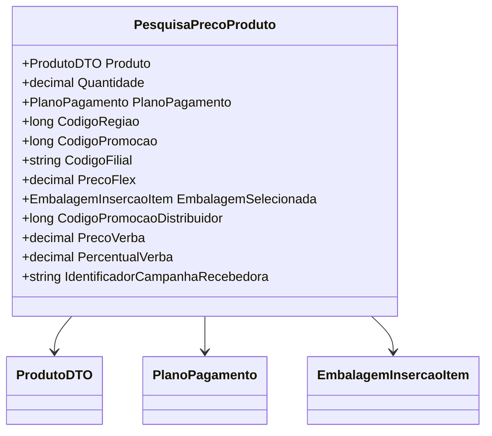
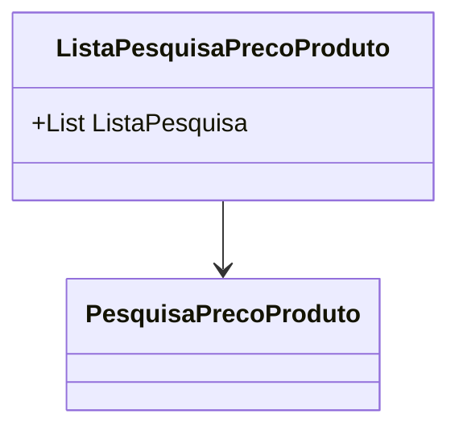

# PesquisaPrecoProduto
**Namespace**: IsthmusWinthor.Dominio.POCO  
**Nome do Arquivo**: PesquisaPrecoProduto.cs  

Essa classe atua como um modelo de dados utilizado para transportar informações sobre a pesquisa de preços de um produto, incluindo detalhes relevantes como quantidade, plano de pagamento e códigos associados.

# ListaPesquisaPrecoProduto
**Namespace**: IsthmusWinthor.Dominio.POCO  
**Nome do Arquivo**: ListaPesquisaPrecoProduto.cs  

Esta classe serve como um contêiner para uma coleção de objetos do tipo `PesquisaPrecoProduto`, permitindo a manipulação em lote das pesquisas realizadas.

---

A classe `PesquisaPrecoProduto` não é apenas um DTO, pois ela envolve informações que são críticas para a lógica de decisão na aplicação. Vamos examiná-la em termos de suas responsabilidades.

# PesquisaPrecoProduto

## Visão Geral e Responsabilidade
A classe `PesquisaPrecoProduto` representa uma estrutura de dados que encapsula informações necessárias para calcular e apresentar o preço de um produto levando em consideração diversos fatores, como quantidade, plano de pagamento e promoções associadas. O desafio que essa classe endereça é fornecer um modelo abrangente que permita avaliações de preços em diferentes contextos e cenários de venda.

## Propriedades
- `Produto`: Um objeto do tipo `[ProdutoDTO](ProdutoDTO.md)` representando os detalhes do produto a ser pesquisado.
- `Quantidade`: Um valor decimal que representa a quantidade do produto.
- `PlanoPagamento`: Um objeto do tipo `[PlanoPagamento](PlanoPagamento.md)` que define as condições de pagamento.
- `CodigoRegiao`: Código numérico que representa a região onde a venda ocorrerá.
- `CodigoPromocao`: Código da promoção que se aplica ao produto.
- `CodigoFilial`: Código que identifica a filial responsável pela venda.
- `PrecoFlex`: O preço flexível do produto, considerando promoções e condições especiais.
- `EmbalagemSelecionada`: Um objeto do tipo `[EmbalagemInsercaoItem](EmbalagemInsercaoItem.md)` que contém informações sobre a embalagem escolhida.
- `CodigoPromocaoDistribuidor`: Código da promoção aplicada ao distribuidor.
- `PrecoVerba`: O preço ajustado de acordo com a verba disponível.
- `PercentualVerba`: O percentual que representa a verba disponível para aplicar na venda.
- `IdentificadorCampanhaRecebedora`: Identificador da campanha de marketing associada à venda.

## Tipos Auxiliares e Dependências
- `[ProdutoDTO](ProdutoDTO.md)`: Tipo auxiliar para representar um produto.
- `[PlanoPagamento](PlanoPagamento.md)`: Tipo auxiliares que define os planos de pagamento.
- `[EmbalagemInsercaoItem](EmbalagemInsercaoItem.md)`: Tipo auxiliar referente à embalagem do produto.

## Diagrama de Relacionamentos

# ListaPesquisaPrecoProduto

## Visão Geral e Responsabilidade
A classe `ListaPesquisaPrecoProduto` serve como um repositório para múltiplas instâncias da classe `PesquisaPrecoProduto`. Seu principal propósito é facilitar a manipulação em grupo de diversas pesquisas de preços, possibilitando operações como iteração, adição e exclusão de itens na lista.

## Propriedades
- `ListaPesquisa`: Uma lista de objetos do tipo `PesquisaPrecoProduto`.

## Diagrama de Relacionamentos

Essa documentação proporciona uma compreensão clara e estruturada das responsabilidades e do funcionamento das classes `PesquisaPrecoProduto` e `ListaPesquisaPrecoProduto`, destacando sua integração em um sistema que lida com preços e promoções de produtos.
