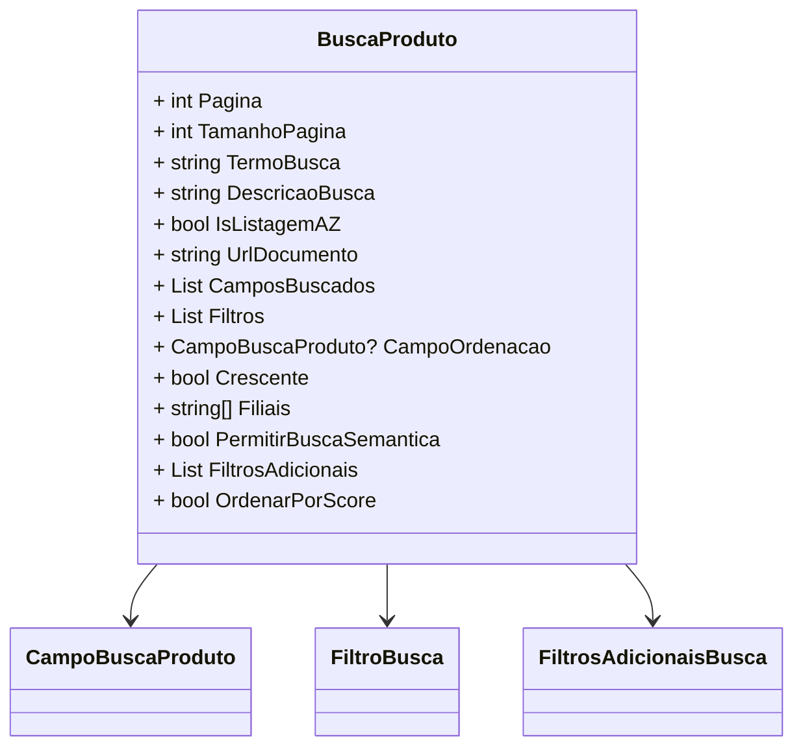

# BuscaProduto
**Namespace**: IsthmusWinthor.Dominio.POCO.PesquisaProdutos  
**Nome do Arquivo**: BuscaProduto.cs  

## Visão Geral e Responsabilidade
A classe `BuscaProduto` é um Rich Domain Model que encapsula a lógica para realizar uma busca detalhada de produtos em um sistema. Ela permite o controle fino de parâmetros de pesquisa, como paginação, filtros e ordenação, garantindo que a busca atenda às necessidades específicas do usuário, como a ordenação alfabética ou por relevância.

## Métodos de Negócio
### Título: `OrdenarPorScore` (Propriedade)
- **Objetivo**: Determina se a busca deve ser ordenada com base em um algoritmo de pontuação, visando melhorar a relevância dos itens retornados.
- **Comportamento**: 
  1. Verifica se o `TermoBusca` não está vazio ou não é um wildcard (`*`).
  2. Verifica se um campo de ordenação (`CampoOrdenacao`) está definido e se esse campo é igual a `CampoBuscaProduto.PrefixoNome`.
  3. Retorna `true` se ambas as condições acima forem atendidas, indicando que a busca pode ser ordenada por relevância.
- **Retorno**: Retorna um valor booleano que indica se a ordenação por score deve ocorrer.

```mermaid
flowchart TD
    A[Início] --> B{TermoBusca vazio ou igual a "*"?}
    B -- Sim --> C[Falha na ordenação por score]
    B -- Não --> D{CampoOrdenacao definido?}
    D -- Não --> C
    D -- Sim --> E{CampoOrdenacao igual a PrefixoNome?}
    E -- Sim --> F[Permitir ordenação por score]
    E -- Não --> C
```

## Propriedades Calculadas e de Validação
### Propriedade: `OrdenarPorScore`
- **Regra**: É calculada com base na presença de um termo de busca válido e na definição do campo de ordenação. Isso assegura que a ordenação ocorra somente quando a busca for relevante.

## Navigations Property
- **Filtros**:  
  - `[CampoBuscaProduto](CampoBuscaProduto.md)`  
  - `[FiltroBusca](FiltroBusca.md)`  
  - `[FiltrosAdicionaisBusca](FiltrosAdicionaisBusca.md)`  

## Tipos Auxiliares e Dependências
- **Enumeradores**:  
  - `[CampoBuscaProduto](CampoBuscaProduto.md)`
  
## Diagrama de Relacionamentos

