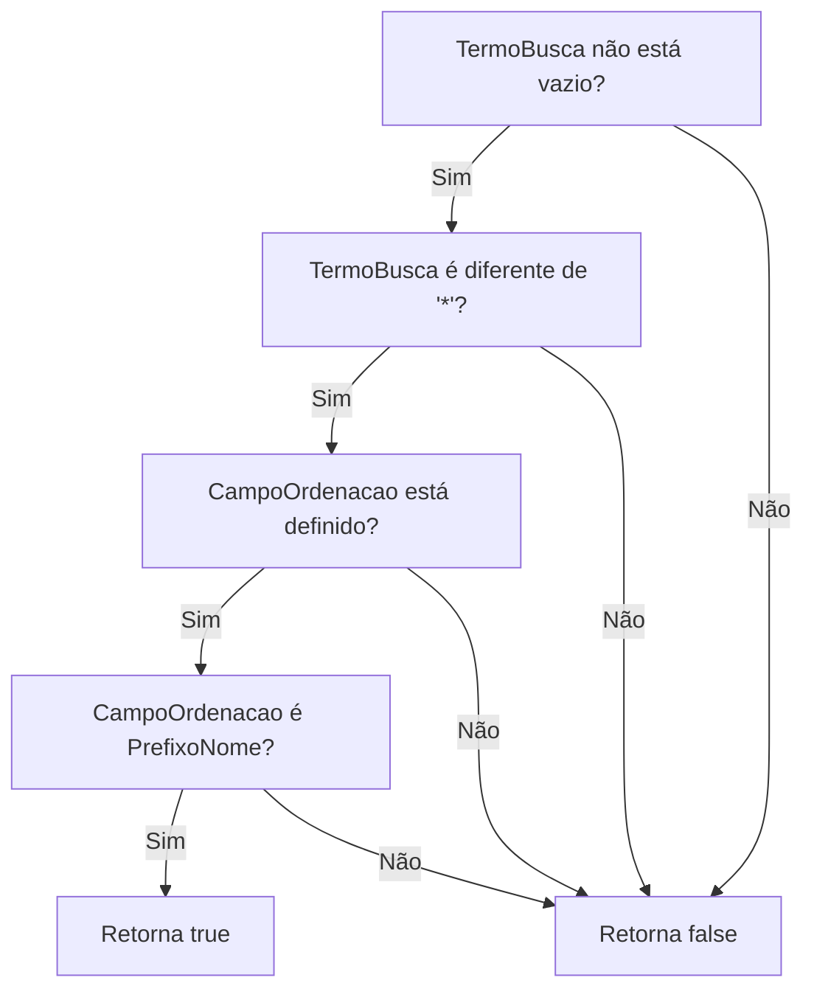
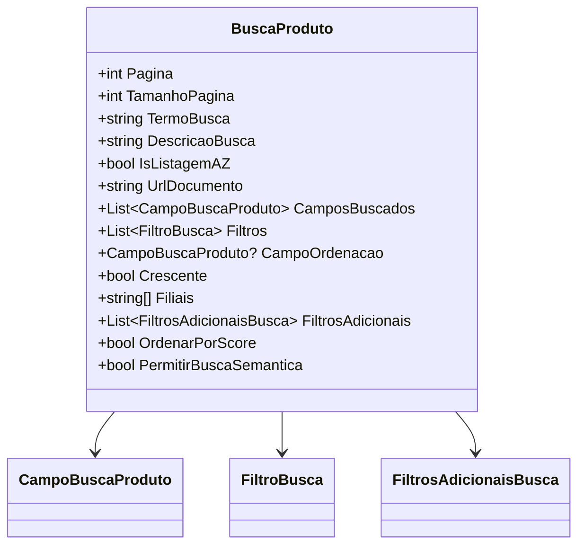

# BuscaProduto
**Namespace**: IsthmusWinthor.Dominio.POCO.PesquisaProdutos  
**Nome do Arquivo**: BuscaProduto.cs  

## Visão Geral e Responsabilidade
A classe `BuscaProduto` atua como um motor de busca complexo para produtos, facilitando a filtragem e ordenação de resultados com base em múltiplos critérios de pesquisa. Seu objetivo é resolver o problema de encontrabilidade de produtos em um sistema de gestão, permitindo que os usuários realizem buscas específicas e organizadas conforme suas necessidades e preferências.

## Métodos de Negócio
**Título**: `OrdenarPorScore` (propriedade)  
**Objetivo**: Garante que a busca seja priorizada por relevância (score) quando certas condições são atendidas.  
**Comportamento**: 
1. Verifica se o `TermoBusca` não está vazio e não é igual a "*".
2. Checa se existe um `CampoOrdenacao` definido.
3. Confirma se o `CampoOrdenacao` é igual a `CampoBuscaProduto.PrefixoNome`.
4. Retorna `true` se todas as condições acima forem satisfeitas, caso contrário, retorna `false`.  

**Retorno**: Retorna um valor booleano indicando se a busca deve ser ordenada por relevância.

## Propriedades Calculadas e de Validação
- **OrdenarPorScore**: Esta propriedade calcula se a busca deve ser ordenada por relevância com base no termo de busca e no tipo de ordenação selecionado. A lógica de negócio aqui é fundamental para oferecer uma experiência de busca mais intuitiva e eficiente.

## Navigations Property
- **CamposBuscados**: Lista de campos que serão utilizados na busca, representados pela classe [CampoBuscaProduto](CampoBuscaProduto.md).
- **Filtros**: Conjunto de filtros que podem ser aplicados na busca, representados pela classe [FiltroBusca](FiltroBusca.md).
- **CampoOrdenacao**: Propriedade que referencia um campo específico a ser utilizado para ordenar os resultados, representado pela classe [CampoBuscaProduto](CampoBuscaProduto.md).

## Tipos Auxiliares e Dependências
- **Enums**: 
  - [CampoBuscaProduto](CampoBuscaProduto.md) - Define os campos que podem ser utilizados durante a busca.
  
## Diagrama de Relacionamentos

---
Gerada em 29/12/2025 21:46:56
