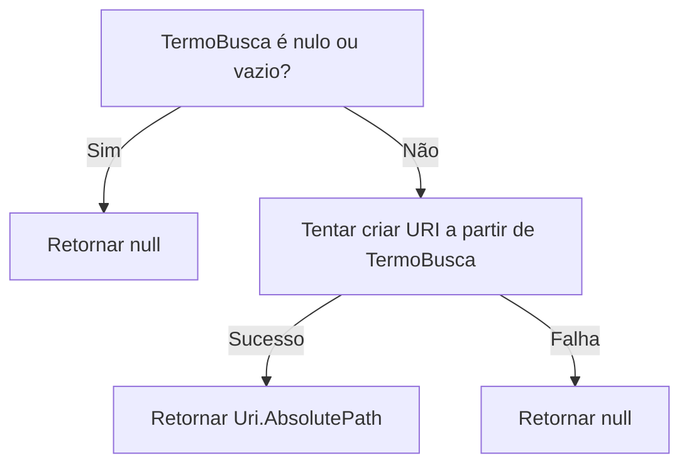
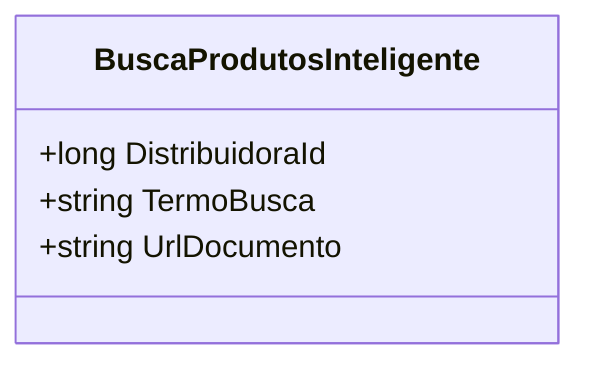

# BuscaProdutosInteligente
**Namespace**: IsthmusWinthor.Dominio.POCO.PesquisaProdutos  
**Nome do Arquivo**: BuscaProdutosInteligente.cs  

## Visão Geral e Responsabilidade
A classe `BuscaProdutosInteligente` representa um modelo de busca para produtos em um sistema de pesquisa, permitindo que os usuários especifiquem um `distribuidoraId` e um `termoBusca`. Esta classe é responsável por manipular as entradas de pesquisa e garantir que as operações relacionadas ao termo de busca estejam válidas e adequadas para a geração de URLs que possam direcionar a consultas específicas de produtos. Assim, resolve o problema de fornecer uma forma inteligente e validada de buscar produtos utilizando uma distribuidora específica.

## Métodos de Negócio

### Título: UrlDocumento (public)
- **Objetivo**: Garante que o termo de busca fornecido produza uma URL válida quando necessário.
- **Comportamento**:
  1. Verifica se `TermoBusca` é nulo ou vazio.
  2. Se for, retorna `null`.
  3. Se não, tenta criar um objeto `Uri` a partir do `TermoBusca`.
  4. Retorna o caminho absoluto da URL, caso a criação da URI tenha sido bem-sucedida. Caso contrário, retorna `null`.
- **Retorno**: O caminho absoluto da URL gerada se `TermoBusca` for válido; caso contrário, retorna `null`.

## Propriedades Calculadas e de Validação

### UrlDocumento
- **Regra**: Garante que uma URL válida é gerada a partir do `TermoBusca`, retornando `null` se o termo não for aplicável ou se não puder ser interpretado como uma URI.

## Navigations Property
- **Nenhuma propriedade complexa do domínio** foi identificada nesta classe.

## Tipos Auxiliares e Dependências
- **Nenhum enumerador ou classe auxiliar** foi identificado como dependências utilizando nesta classe.

## Diagrama de Relacionamentos

---
Gerada em 29/12/2025 21:47:07
