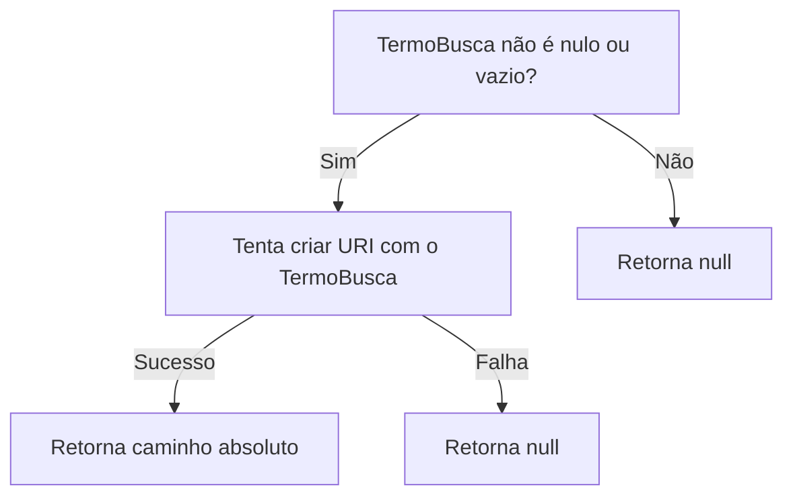
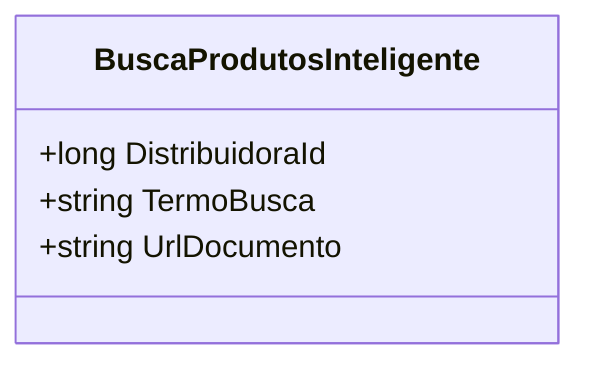

# BuscaProdutosInteligente
- **Namespace**: IsthmusWinthor.Dominio.POCO.PesquisaProdutos
- **Nome do Arquivo**: BuscaProdutosInteligente.cs

## Visão Geral e Responsabilidade
A classe `BuscaProdutosInteligente` representa um modelo de domínio responsável por encapsular a lógica de busca de produtos de forma aprimorada, considerando a distribuição de produtos e os termos de busca informados. Sua finalidade é permitir que operadores nas empresas utilizem um identificador de distribuidora e um termo de busca para localizar produtos de maneira intuitiva. A lógica da classe assegura que termos de busca válidos sejam processados e convertidos em URLs adequadas para facilitar a navegação.

## Métodos de Negócio
### Título: `UrlDocumento` (Propriedade Calculada)
- **Objetivo**: Garante que apenas URLs válidas sejam geradas a partir do termo de busca fornecido.
- **Comportamento**:
  1. Verifica se o `TermoBusca` está nulo ou vazio.
  2. Se estiver, retorna `null`.
  3. Caso contrário, tenta criar uma URI absoluta utilizando o `TermoBusca`.
  4. Retorna o caminho absoluto da URI se a criação foi bem-sucedida; caso contrário, retorna `null`.
- **Retorno**: Fornece o caminho da URL se o termo for válido; retorna `null` se o termo for inválido ou não estiver presente.

## Propriedades Calculadas e de Validação
### `UrlDocumento`
- **Regra**: A propriedade valida se o `TermoBusca` é um URL adequado e retorna apenas o caminho absoluto correspondente se for válido, ou `null` caso contrário.

## Navigations Property
Não existem propriedades que representam classes complexas do domínio nesta classe.

## Tipos Auxiliares e Dependências
- Não há enumeradores (Enums) ou classes estáticas/helpers que a classe utiliza diretamente.

## Diagrama de Relacionamentos

