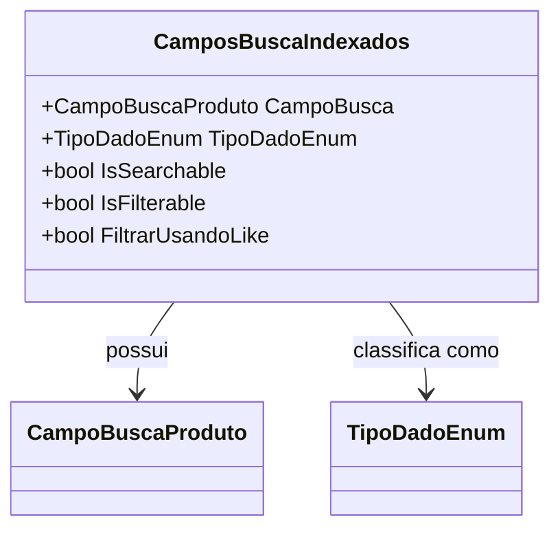

# CamposBuscaIndexados
**Namespace**: IsthmusWinthor.Dominio.POCO.PesquisaProdutos  
**Nome do Arquivo**: CamposBuscaIndexados.cs  

## Visão Geral e Responsabilidade
A classe `CamposBuscaIndexados` atua como um repositório central para a definição e gestão dos campos de busca indexados no sistema. Seu papel é garantir a integridade e a acessibilidade dos dados relacionados à pesquisa de produtos, permitindo que os usuários realizem pesquisas e filtros de maneira consistente e eficiente. Essa classe também cuida das regras de negócio associadas à quais campos são pesquisáveis e filtráveis, promovendo a otimização das operações de busca.

## Métodos de Negócio

### Título: CamposPesquisaveis
- **Visibilidade**: `public static`
- **Objetivo**: Retornar uma lista de campos que são marcados como pesquisáveis.
- **Comportamento**: 
  1. Filtra os campos armazenados na lista `CamposIndexados`.
  2. Seleciona apenas aqueles que têm a propriedade `IsSearchable` como verdadeira.
  3. Constrói e retorna uma lista com os campos filtrados.
- **Retorno**: Uma lista de `CampoBuscaProduto` representando todos os campos que podem ser utilizados em uma pesquisa.

### Título: CamposPesquisaveisCodigo
- **Visibilidade**: `public static`
- **Objetivo**: Fornecer uma lista fixa de campos que podem ser utilizados especificamente com códigos.
- **Comportamento**: 
  1. Cria e retorna uma nova lista contendo produtos com códigos importantes.
- **Retorno**: Uma lista de `CampoBuscaProduto` que contém campos específicos úteis para pesquisas por código.

### Título: CamposOrdenaveis
- **Visibilidade**: `public static`
- **Objetivo**: Retornar um dicionário com campos que podem ser ordenados e suas respectivas representações formatadas.
- **Comportamento**:
  1. Cria um dicionário associando `CampoBuscaProduto` com strings formatadas para ordenação.
  2. Formata os nomes dos campos usando a função `LowerCaseFirstLetter` para garantir consistência em busca e exibição.
- **Retorno**: Um dicionário onde as chaves são campos de busca e os valores são suas representações em formato lowercase.

### Título: LowerCaseFirstLetter
- **Visibilidade**: `public static`
- **Objetivo**: Converter a primeira letra de uma string para minúscula.
- **Comportamento**:
  1. Verifica se a string é nula ou vazia.
  2. Retorna a string original se estiver vazia, ou modifica a primeira letra para minúscula.
- **Retorno**: A string com a primeira letra em minúscula ou a string original.

## Propriedades Calculadas e de Validação
Não há propriedades que possuam lógica de validação ou cálculo, uma vez que todas as propriedades são simples e desempenham um papel direto na representação de um campo de busca.

## Navigations Property
Não há propriedades de navegação que representem classes complexas do domínio.

## Tipos Auxiliares e Dependências
- Enumeradores:
  - [CampoBuscaProduto](CampoBuscaProduto.md)
  - [TipoDadoEnum](TipoDadoEnum.md)

## Diagrama de Relacionamentos

Esta documentação oferece uma visão clara das regras de negócio implementadas na classe `CamposBuscaIndexados`, suas responsabilidades e como ela deve ser utilizada dentro do contexto da aplicação. A estrutura e os métodos apresentados garantem que a integridade dos dados e a facilidade de pesquisa sejam mantidas.
---
Gerada em 29/12/2025 21:47:25
