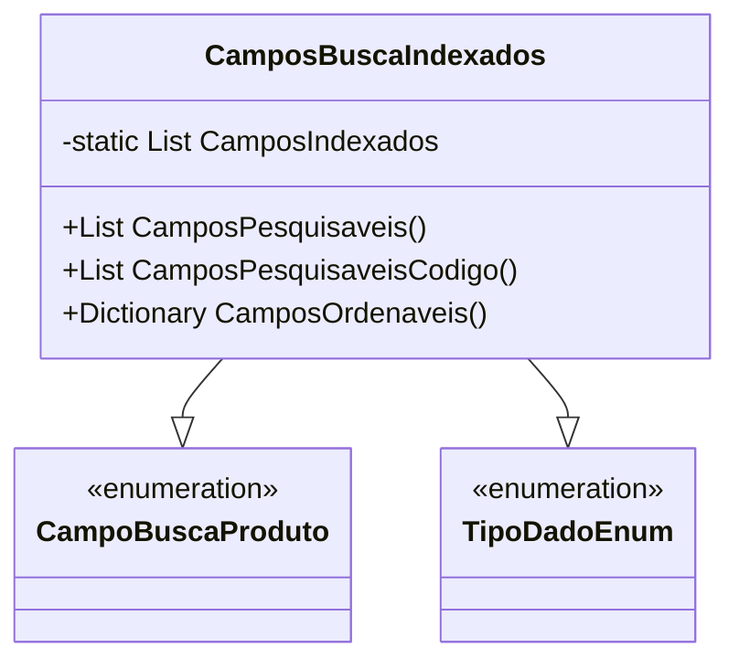

# CamposBuscaIndexados
**Namespace**: IsthmusWinthor.Dominio.POCO.PesquisaProdutos  
**Nome do Arquivo**: CamposBuscaIndexados.cs  

## Visão Geral e Responsabilidade
A classe `CamposBuscaIndexados` atua como um motor de configuração para os campos utilizados em operações de busca de produtos dentro de um sistema de pesquisa. Ela encapsula informações sobre quais campos podem ser pesquisados e filtráveis, otimizando a manipulação de dados na busca de produtos, facilitando a consulta e permitindo uma filtragem eficiente. Essa estrutura é crucial para garantir que os dados retornados nas buscas sejam relevantes e em conformidade com as regras de negócio.

## Métodos de Negócio

### Título: CamposPesquisaveis
- **Visibilidade**: `public static`
- **Objetivo**: Garante que apenas campos configurados como pesquisáveis sejam retornados.
- **Comportamento**: 
  1. Filtra a lista de campos indexados, selecionando apenas aqueles marcados como pesquisáveis (`IsSearchable`).
  2. Retorna uma lista de `CampoBuscaProduto` correspondente aos campos filtrados.
- **Retorno**: Uma lista de `CampoBuscaProduto`, que representa os campos que podem ser utilizados em operações de busca.

### Título: CamposPesquisaveisCodigo
- **Visibilidade**: `public static`
- **Objetivo**: Fornece uma lista pré-definida de campos que são especificamente identificáveis por código.
- **Comportamento**:
  1. Retorna uma nova lista contendo campos de busca predefinidos que podem ser utilizados em pesquisas por código.
- **Retorno**: Uma lista de `CampoBuscaProduto`, que contém os códigos dos campos pesquisáveis.

### Título: CamposOrdenaveis
- **Visibilidade**: `public static`
- **Objetivo**: Define quais campos podem ser utilizados para ordenação em consultas e suas representações.
- **Comportamento**:
  1. Retorna um dicionário contendo `CampoBuscaProduto` como chave e uma string representativa como valor.
  2. A string gerada é baseada no nome do campo, com a primeira letra em minúsculo e, quando aplicável, adicionando sufixos `.keyword` para adequação em sistemas de busca.
- **Retorno**: Um `Dictionary<CampoBuscaProduto, string>`, que associa campos a suas representações em strings para ordenação.

## Propriedades Calculadas e de Validação
Não existem propriedades com lógica de cálculo ou validação na camada de getters e setters. Todas as propriedades são geridas diretamente pelo construtor.

## Navigation Property
Não existem classes complexas do domínio referenciadas por esta classe.

## Tipos Auxiliares e Dependências
- **Enums**:
  - `[TipoDadoEnum](TipoDadoEnum.md)` - Enum para definir os tipos de dados que podem ser utilizados nos campos de busca.
- **Classes Auxiliares**:
  - `[CampoBuscaProduto](CampoBuscaProduto.md)` - Enum que define os distintos campos que podem ser utilizados nas operações de busca.

## Diagrama de Relacionamentos

