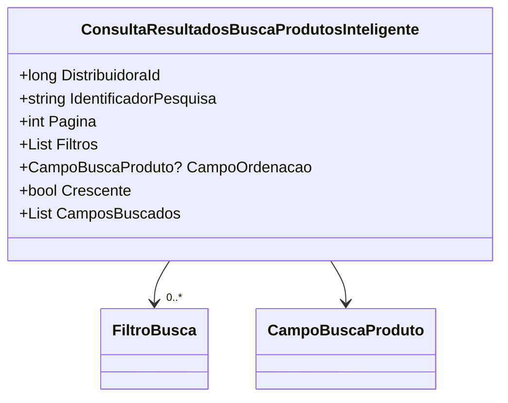

# ConsultaResultadosBuscaProdutosInteligente
**Namespace**: IsthmusWinthor.Dominio.POCO.PesquisaProdutos  
**Nome do Arquivo**: ConsultaResultadosBuscaProdutosInteligente.cs

Esta classe é um DTO responsável pelo transporte de dados relacionados à consulta de resultados de busca de produtos inteligentes, facilitando a comunicação entre diferentes camadas do sistema.

---

### Propriedades

- **DistribuidoraId**: Identificador da distribuidora responsável pelos produtos a serem buscados.
- **IdentificadorPesquisa**: Identificador único da pesquisa realizada.
- **Pagina**: Número da página atual nos resultados da busca.
- **Filtros**: Lista de filtros aplicáveis à busca de produtos.
- **CampoOrdenacao**: Campo pelo qual os resultados devem ser ordenados.
- **Crescente**: Indica se a ordenação deve ser em ordem crescente ou decrescente.
- **CamposBuscados**: Propriedade calculada que sempre retorna uma lista contendo o campo `Codigo` como o único campo buscado.

### Propriedades Calculadas e de Validação

- **CamposBuscados**: 
  - **Regra**: Retorna uma lista fixa que contém apenas o `CampoBuscaProduto.Codigo`, validando assim que apenas o código dos produtos é considerado para busca.

### Navigations Property

- **Filtros**: Lista de [FiltroBusca](FiltroBusca.md), que serve para refinar os critérios de busca.
- **CampoOrdenacao**: [CampoBuscaProduto](CampoBuscaProduto.md), que define como os resultados devem ser organizados.

### Tipos Auxiliares e Dependências

- **FiltroBusca**: [FiltroBusca](FiltroBusca.md) - Usado para definir filtros de pesquisa.
- **CampoBuscaProduto**: [CampoBuscaProduto](CampoBuscaProduto.md) - Enumarador usado para especificar os campos de busca e ordenação.

### Diagrama de Relacionamentos

---
Gerada em 29/12/2025 21:47:38
