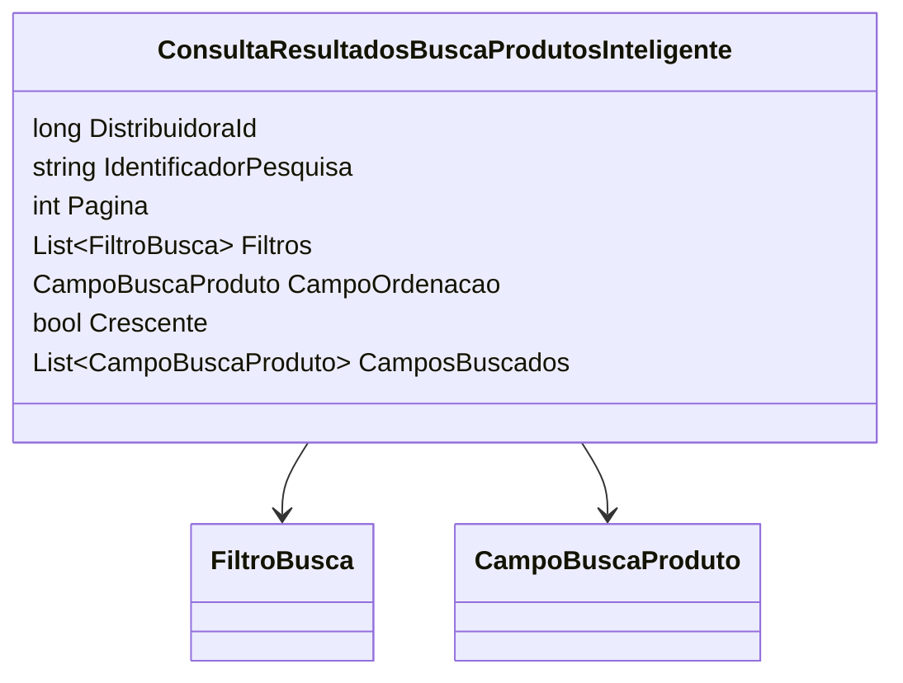

# ConsultaResultadosBuscaProdutosInteligente
**Namespace**: IsthmusWinthor.Dominio.POCO.PesquisaProdutos  
**Nome do Arquivo**: ConsultaResultadosBuscaProdutosInteligente.cs  

## Visão Geral e Responsabilidade
A classe `ConsultaResultadosBuscaProdutosInteligente` tem a responsabilidade de modelar a consulta de resultados na busca de produtos de forma inteligente, utilizando filtros e critérios definidos. Ela permite ao usuário especificar quais produtos deseja buscar e como deseja ordenar os resultados, atendendo à necessidade de uma busca eficiente em um sistema de vendas/estoque.

## Métodos de Negócio
### Título: `CamposBuscados` (Público)
- **Objetivo**: Garante que os campos buscados para a consulta estão sempre limitados ao `CampoBuscaProduto.Codigo`.
- **Comportamento**: Este método é uma propriedade calculada que retorna uma lista contendo o campo específico que deve ser buscado, que neste caso é o `Codigo`. Não há lógica condicional, apenas retorna uma lista fixa.
- **Retorno**: Retorna um `List<CampoBuscaProduto>` contendo o campo `CampoBuscaProduto.Codigo`.

## Propriedades Calculadas e de Validação
- `CamposBuscados`: Retorna sempre uma lista contendo o `CampoBuscaProduto.Codigo`. Este campo é fixo e não pode ser alterado, estabelecendo uma restrição nas buscas.

## Navigation Property
- Não há propriedades que sejam classes complexas do domínio dentro desta classe.

## Tipos Auxiliares e Dependências
- **Enumeradores**:
  - `[CampoBuscaProduto](CampoBuscaProduto.md)`
- **Outros**:
  - `[FiltroBusca](FiltroBusca.md)`: Representa filtros que podem ser aplicados na busca.

## Diagrama de Relacionamentos

