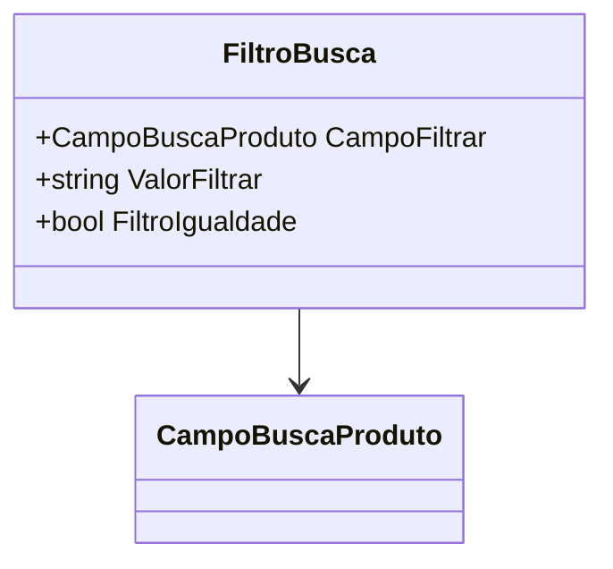

# FiltroBusca
**Namespace**: IsthmusWinthor.Dominio.POCO.PesquisaProdutos  
**Nome do Arquivo**: FiltroBusca.cs  

## Visão Geral e Responsabilidade
A classe `FiltroBusca` representa uma estrutura de filtragem utilizada na pesquisa de produtos. Seu papel é encapsular as condições de busca que o sistema deve aplicar ao executar consultas relacionadas a produtos. Isso inclui determinar qual campo pesquisar, o valor a ser buscado e a natureza da comparação (se a busca deve considerar igualdade ou diferença). Essa abordagem ajuda a garantir que as operações de busca sejam flexíveis e adaptáveis às necessidades do usuário.

## Métodos de Negócio
### Construtores
#### Construtor: `FiltroBusca()`
- **Objetivo**: Inicializa um novo objeto `FiltroBusca` sem parâmetros, permitindo a configuração posterior.
- **Comportamento**: Cria uma instância vazia da classe.
- **Retorno**: Não retorna valor; é um construtor.

#### Construtor: `FiltroBusca(CampoBuscaProduto campoFiltrar, string valorFiltrar, bool filtroIgualdade)`
- **Objetivo**: Permite a criação de um novo filtro com parâmetros configurados, definindo qual campo filtrar e o valor de filtragem com uma condição de igualdade.
- **Comportamento**: Atribui `CampoFiltrar`, `ValorFiltrar` e `FiltroIgualdade` conforme os parâmetros fornecidos.
- **Retorno**: Não retorna valor; é um construtor.

#### Construtor: `FiltroBusca(CampoBuscaProduto campoFiltrar, string valorFiltrar)`
- **Objetivo**: Inicializa o filtro utilizando um campo e um valor, com a condição de igualdade padrão para `true`.
- **Comportamento**: Atribui `CampoFiltrar` e `ValorFiltrar`, definindo automaticamente `FiltroIgualdade` como `true`.
- **Retorno**: Não retorna valor; é um construtor.

## Propriedades Calculadas e de Validação
- **FiltroIgualdade**: Indica se a filtragem deve ser feita considerando igualdade (`true`) ou diferença (`false`). A lógica por trás dessa propriedade garante que, quando o campo buscado for de tipo booleano, a comparação sempre será considerada como uma busca por igualdade, assegurando que o comportamento do filtro seja intuitivo.

## Navigations Property
Nenhuma propriedade corresponde a classes complexas do domínio.

## Tipos Auxiliares e Dependências
- **Enumeradores**:
  - [`CampoBuscaProduto`](CampoBuscaProduto.md): Enumerador que representa os diferentes campos que podem ser utilizados para filtrar produtos.

## Diagrama de Relacionamentos

