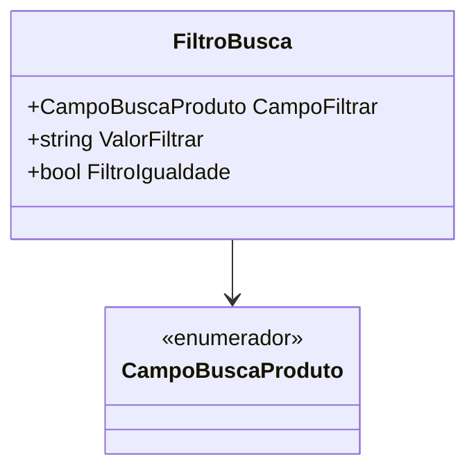

# FiltroBusca
**Namespace**: IsthmusWinthor.Dominio.POCO.PesquisaProdutos  
**Nome do Arquivo**: FiltroBusca.cs  

## Visão Geral e Responsabilidade
A classe `FiltroBusca` representa um filtro utilizado na busca de produtos em um sistema, permitindo que as consultas sejam realizadas com base em campos específicos e valores fornecidos. Essa classe é fundamental para facilitar a localização de produtos dentro de um catálogo, promovendo uma pesquisa mais eficiente e dirigida, atendendo à necessidade do usuário de encontrar rapidamente itens que atendam a critérios específicos.

## Métodos de Negócio

### Construtor: `FiltroBusca()`
**Objetivo**: Inicializa uma nova instância da classe `FiltroBusca` com valores padrão.  
**Comportamento**: Este construtor não recebe parâmetros e simplesmente cria um objeto vazio, possibilitando que suas propriedades sejam configuradas posteriormente.  
**Retorno**: Não aplica.

### Construtor: `FiltroBusca(CampoBuscaProduto campoFiltrar, string valorFiltrar, bool filtroIgualdade)`
**Objetivo**: Inicializa uma nova instância da classe `FiltroBusca` configurando os campos de filtragem, o valor a ser filtrado e o modo de comparação.  
**Comportamento**: Este construtor recebe como parâmetros:
 - `campoFiltrar`: O campo do produto a ser utilizado para a pesquisa.
 - `valorFiltrar`: O valor que será comparado no filtro.
 - `filtroIgualdade`: Determina se a busca será realizada por igualdade ou por diferença.  
**Retorno**: Não aplica.

### Construtor: `FiltroBusca(CampoBuscaProduto campoFiltrar, string valorFiltrar)`
**Objetivo**: Inicializa uma nova instância da classe `FiltroBusca` definindo o campo e o valor para a busca, utilizando o modo de comparação padrão (igualdade).  
**Comportamento**: Este construtor chama o outro, configurando o `FiltroIgualdade` como `true`, garantindo que a busca seja feita por igualdade.  
**Retorno**: Não aplica.

## Propriedades Calculadas e de Validação

### `FiltroIgualdade`
Esta propriedade determina como a busca é realizada. Se `true`, o filtro busca por igualdade (ex: produtos que têm exatamente o valor especificado). Se `false`, a busca retorna itens que não correspondem ao valor, exceto quando o campo buscado for do tipo `bool`, onde o filtro é sempre aplicado por igualdade.

## Navigations Property

- [CampoBuscaProduto](CampoBuscaProduto.md)

## Tipos Auxiliares e Dependências

- [CampoBuscaProduto](CampoBuscaProduto.md)
- Considerações sobre tipos de filtro em `CampoBuscaProduto`, que lista os possíveis campos que podem ser utilizados para filtrar produtos.

## Diagrama de Relacionamentos

---
Gerada em 29/12/2025 21:47:52
