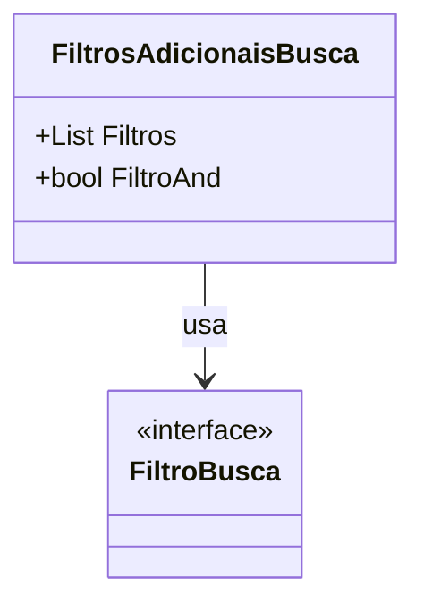

# FiltrosAdicionaisBusca
**Namespace**: IsthmusWinthor.Dominio.POCO.PesquisaProdutos  
**Nome do Arquivo**: FiltrosAdicionaisBusca.cs

### Visão Geral e Responsabilidade
A classe `FiltrosAdicionaisBusca` serve como um modelo para encapsular filtros de busca usados na pesquisa de produtos dentro da plataforma. Ela permite a aplicação de múltiplos filtros de forma flexível, utilizando operadores lógicos AND e OR. O problema de negócio que essa classe resolve é a necessidade de refinar resultados de busca através de combinações de critérios específicos, possibilitando que usuários obtenham resultados mais relevantes e direcionados.

### Métodos de Negócio
Nenhum método com lógica complexa foi identificado nesta classe, portanto, esta seção não se aplica.

### Propriedades Calculadas e de Validação
Não há propriedades que utilizem lógica no método `get` ou validação no método `set` nesta classe.

### Navigations Property
- [FiltroBusca](FiltroBusca.md): Representa as diferentes condições de filtragem que podem ser aplicadas na busca de produtos.

### Tipos Auxiliares e Dependências
- Não há enumeradores ou classes estáticas/helpers utilizadas pela classe `FiltrosAdicionaisBusca`.

### Diagrama de Relacionamentos

Esta documentação fornece uma visão clara da função e estrutura da classe `FiltrosAdicionaisBusca`, além de indicar como ela se relaciona com outros elementos do domínio.
---
Gerada em 29/12/2025 21:48:00
