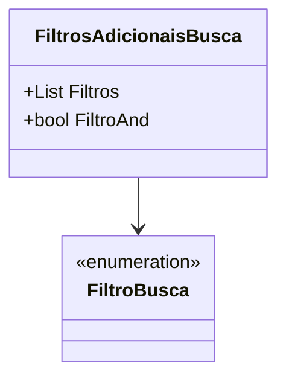

# FiltrosAdicionaisBusca
**Namespace**: IsthmusWinthor.Dominio.POCO.PesquisaProdutos  
**Nome do Arquivo**: FiltrosAdicionaisBusca.cs

> Classe que transporta filtros adicionais para pesquisas de produtos, permitindo a combinação de critérios de busca.

## Visão Geral e Responsabilidade
A classe `FiltrosAdicionaisBusca` tem como objetivo gerenciar e aplicar critérios de filtragem em buscas de produtos, proporcionando flexibilidade na combinação de múltiplos filtros. Através dos parâmetros que define, ela permite que o usuário escolha entre aplicar filtros de forma cumulativa (AND) ou alternativa (OR), resolvendo problemas de busca específica conforme os requisitos do negócio.

## Métodos de Negócio
- **Título**: Construtor (Visibilidade: Público)
  - **Objetivo**: Inicializar a classe `FiltrosAdicionaisBusca` com uma lista de filtros e um indicativo de operação lógica (AND/OR).
  - **Comportamento**: 
    1. O construtor padrão inicializa a classe sem filtros.
    2. O construtor sobrecarregado recebe uma lista de objetos `FiltroBusca` e um booleano `filtroAnd` para determinar a lógica de combinação.
  - **Retorno**: Não possui retorno, mas define o estado interno da classe.

## Propriedades Calculadas e de Validação
- **Filtros**: Propriedade que armazena uma lista de objetos do tipo `FiltroBusca`. Não contém lógica adicional no getter e setter.
- **FiltroAnd**: Propriedade booleana que define se os filtros devem ser aplicados com a lógica AND ou OR. Não há validação adicional.

## Navigations Property
- `[FiltroBusca](FiltroBusca.md)`: Representa a classe que define os filtros individuais que podem ser aplicados nas buscas.

## Tipos Auxiliares e Dependências
- `[FiltroBusca](FiltroBusca.md)`: Classe utilizada como um dos componentes da lista de filtros.
  
## Diagrama de Relacionamentos

