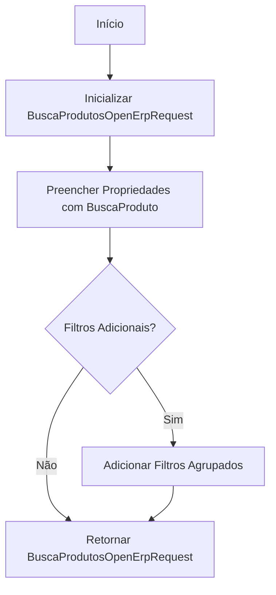
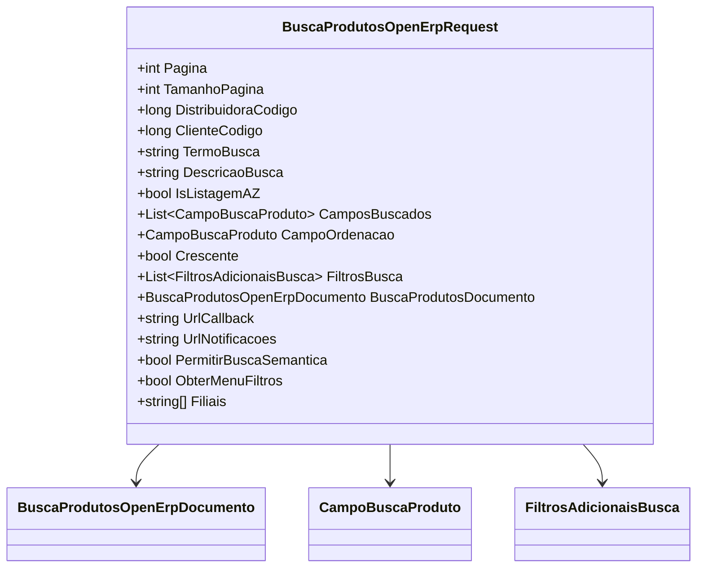

# BuscaProdutosOpenErpRequest
**Namespace**: IsthmusWinthor.Dominio.POCO.PesquisaProdutos.OpenErp  
**Nome do Arquivo**: BuscaProdutosOpenErpRequest.cs  

## Visão Geral e Responsabilidade
A classe `BuscaProdutosOpenErpRequest` é responsável por encapsular os critérios e parâmetros de busca de produtos em uma aplicação ligada a um sistema ERP (Enterprise Resource Planning). Sua principal finalidade é garantir que a solicitação de busca de produtos possua todos os dados necessários, aplicando a lógica de preparação dos parâmetros antes de realizar a busca. Isso inclui gerenciamento de paginação, filtragem e formatação dos critérios de busca em um único objeto, permitindo assim uma comunicação eficaz entre as camadas da aplicação.

## Métodos de Negócio

### Título: `Novo` (Estático)
- **Objetivo:** Garantir a criação de uma nova instância de `BuscaProdutosOpenErpRequest` de forma consistente, utilizando os dados fornecidos em um objeto `BuscaProduto`.
  
- **Comportamento:**
  1. Inicializa um novo objeto `BuscaProdutosOpenErpRequest`.
  2. Preenche as propriedades de paginação, campo de ordenação, e outros parâmetros com os valores contidos no objeto `BuscaProduto`.
  3. Aplica a lógica para adicionar filtros adicionais, se houver.
  4. Retorna a instância totalmente configurada.

- **Retorno:** Retorna uma instância de `BuscaProdutosOpenErpRequest` com todos os parâmetros de busca configurados, pronta para ser utilizada em consultas.

## Propriedades Calculadas e de Validação
- `ObterMenuFiltros`: Esta propriedade é configurada pelo construtor e possui a lógica de validação que garante que a informação sobre a necessidade de obter o menu de filtros seja expressa de forma clara e precisa, influenciando o comportamento da interface.

## Navigation Property
- `BuscaProdutosDocumento`: Representa um documento de busca de produtos, que pode conter informações adicionais sobre a busca. 
  - [BuscaProdutosOpenErpDocumento](BuscaProdutosOpenErpDocumento.md)

## Tipos Auxiliares e Dependências
- **Enumeradores e Classes:**
  - `[CampoBuscaProduto](CampoBuscaProduto.md)`
  - `[FiltrosAdicionaisBusca](FiltrosAdicionaisBusca.md)`

## Diagrama de Relacionamentos

