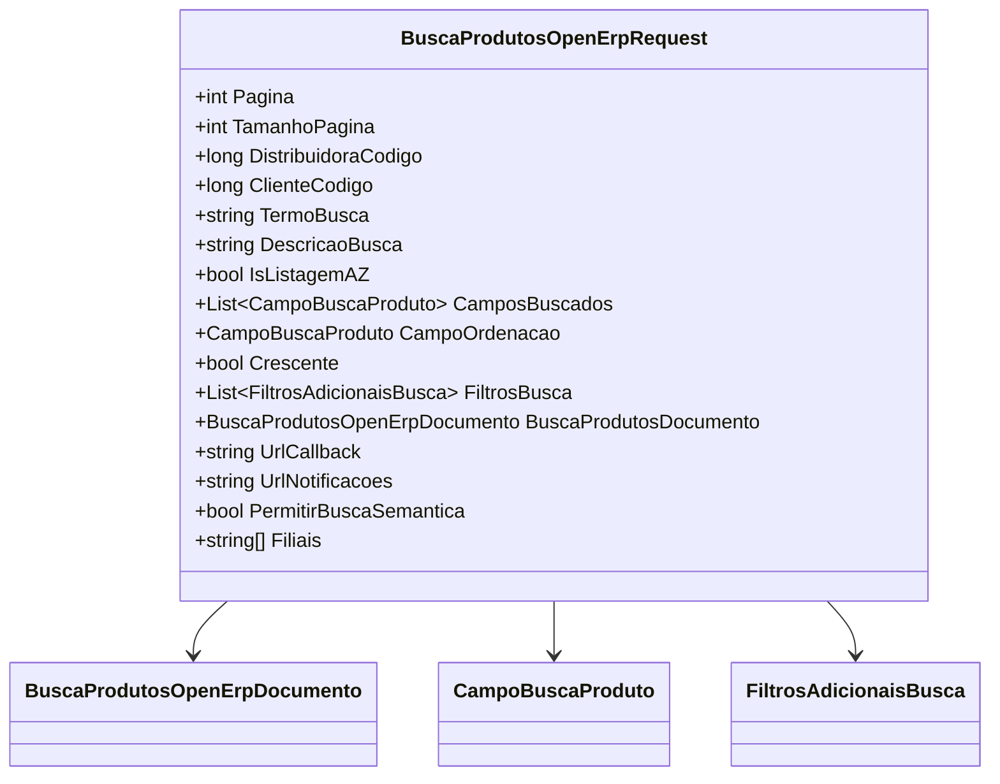

# BuscaProdutosOpenErpRequest
**Namespace**: IsthmusWinthor.Dominio.POCO.PesquisaProdutos.OpenErp  
**Nome do Arquivo**: BuscaProdutosOpenErpRequest.cs  

## Visão Geral e Responsabilidade
A classe `BuscaProdutosOpenErpRequest` é responsável por encapsular os dados necessários para realizar uma busca de produtos no sistema OpenErp. Ela serve como um objeto de transferência que transporta as informações do cliente, critérios de busca e filtros, otimizando a requisição e a resposta do serviço de busca de produtos. A classe traduz os requisitos do negócio para a execução de buscas eficientes e personalizadas, permitindo que um usuário final obtenha rapidamente os produtos desejados através de filtros específicos.

## Métodos de Negócio

### Novo (Estático)
- **Objetivo**: Este método garante a criação de um novo objeto `BuscaProdutosOpenErpRequest` com as propriedades e valores necessários para realizar uma busca de produtos com as condições de busca especificadas.
- **Comportamento**: 
  1. Inicializa um novo objeto `BuscaProdutosOpenErpRequest`.
  2. Atribui as propriedades do objeto com base nos valores da instância `BuscaProduto` fornecida.
  3. Se a lista de filtros não estiver vazia, agrupa os filtros existentes por campo e agrega-os aos filtros adicionais da requisição.
  4. Retorna a instância recém-criada e configurada.
- **Retorno**: Um objeto `BuscaProdutosOpenErpRequest`, pronto para ser utilizado em uma operação de busca de produtos.

```mermaid
flowchart TD
    A[Novo(BuscaProduto buscaProduto, long distribuidoraId, long codigoCliente, string urlCallback, string urlNotificacoes, bool obterMenuFiltros)] --> B[Inicializa BuscaProdutosOpenErpRequest]
    B --> C[Atribui propriedades]
    C -->|Filtros não vazios| D[Grupo filtros por CampoFiltrar]
    D --> E[Adiciona filtros ao FiltrosBusca]
    C --> F[Retorna BuscaProdutosOpenErpRequest]
```

## Propriedades Calculadas e de Validação
- **Propriedade**: `ObterMenuFiltros`
  - **Regra**: Esta propriedade é configurada apenas pela lógica do método `Novo` e representa se o menu de filtros adicionais deve ser obtido ou não. Ela é marcada como `private set`, evitando alterações externas.

## Navigation Property
- **BuscaProdutosDocumento**: Representa um documento associado à busca de produtos, que pode ser instanciado a partir de uma URL fornecida através de `BuscaProduto`. É uma classe complexa que contém detalhes do documento. 
  - [BuscaProdutosOpenErpDocumento](BuscaProdutosOpenErpDocumento.md)

## Tipos Auxiliares e Dependências
- **Classes**:
  - [CampoBuscaProduto](CampoBuscaProduto.md)
  - [FiltrosAdicionaisBusca](FiltrosAdicionaisBusca.md)

## Diagrama de Relacionamentos

---
Gerada em 29/12/2025 21:48:54
