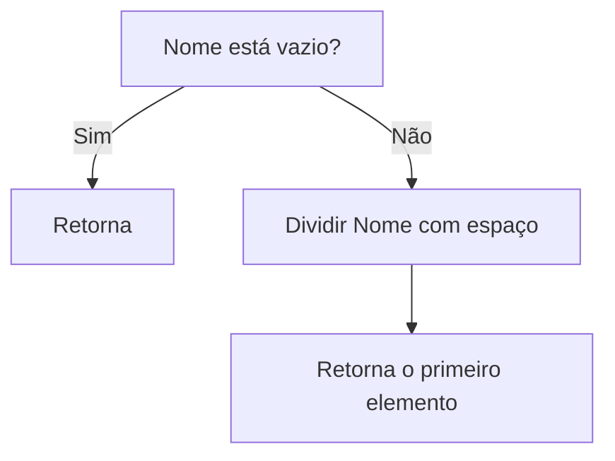
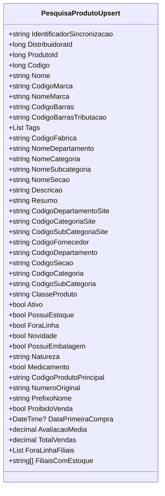

# PesquisaProdutoUpsert
**Namespace**: IsthmusWinthor.Dominio.POCO.PesquisaProdutos  
**Nome do Arquivo**: PesquisaProdutoUpsert.cs  

## Visão Geral e Responsabilidade
A classe `PesquisaProdutoUpsert` é responsável por encapsular as informações necessárias para a inserção ou atualização de produtos em um sistema de pesquisa. Ela garante a integridade e a coerência dos dados de produtos, permitindo o gerenciamento eficiente de informações como identificação, descrição, categorização e status de disponibilidade de produtos. Essa classe é essencial para a sincronização de dados de produtos entre sistemas e para a apresentação correta das informações ao usuário final.

## Métodos de Negócio
### Título: `PrefixoNome` (get)
* **Objetivo**: Extrair e retornar o primeiro nome do produto, caso o nome esteja disponível. Isso é utilizado para categorizar rapidamente os produtos com base em seu nome.
* **Comportamento**: 
  - Verifica se a propriedade `Nome` está vazia.
  - Se não estiver vazia, divide a string do `Nome` em um array utilizando o espaço como delimitador e retorna o primeiro elemento.
  - Se estiver vazia, retorna uma string vazia.
* **Retorno**: Retorna uma string representando o prefixo do nome do produto ou uma string vazia se o nome não estiver definido.

### Visualização

## Propriedades Calculadas e de Validação
### `PrefixoNome`
- **Regra**: Esta propriedade calcula o prefixo do nome do produto. Se o nome for definido, ela extrai a primeira palavra. Essa informação pode ser utilizada, por exemplo, para pesquisas ou listagens que exigem o uso do primeiro termo do nome do produto.

## Navigations Property
- N/A: A classe `PesquisaProdutoUpsert` não possui propriedades que referenciam classes complexas do domínio.

## Tipos Auxiliares e Dependências
- Nenhum enumerador ou classe auxiliar externa referenciada.

## Diagrama de Relacionamentos

