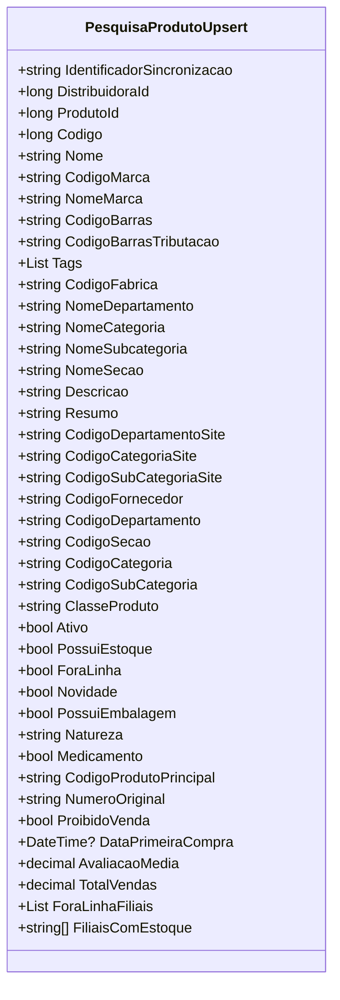

# PesquisaProdutoUpsert
**Namespace**: IsthmusWinthor.Dominio.POCO.PesquisaProdutos  
**Nome do Arquivo**: PesquisaProdutoUpsert.cs  

## Visão Geral e Responsabilidade
A classe `PesquisaProdutoUpsert` é responsável por transportar dados relacionados à pesquisa e atualização de produtos em um sistema corporativo. Ela serve como um modelo que encapsula as informações pertinentes de um produto, permitindo que operações de inserção e atualização sejam realizadas de forma consistente e válida. O objetivo principal é facilitar a gestão dos dados de produtos, garantindo que todos os atributos necessários para a pesquisa e atualização sejam devidamente encapsulados e acessíveis.

## Propriedades Calculadas e de Validação
- **PrefixoNome**: 
  - **Regra**: Extraí o primeiro nome do campo `Nome`, retornando uma string vazia se `Nome` for nulo ou vazio. Esta propriedade é usada para fins de categorização ou agrupamento no sistema.
  
## Navigations Property
- As seguintes propriedades representam classes complexas ou conjuntos de dados no sistema:
  - Não há propriedades complexas do domínio diretamente associadas a `PesquisaProdutoUpsert`.

## Tipos Auxiliares e Dependências
- Nenhum enumerador ou classe estática/helper é utilizado diretamente por esta classe.

## Diagrama de Relacionamentos

---
Gerada em 29/12/2025 21:48:14
