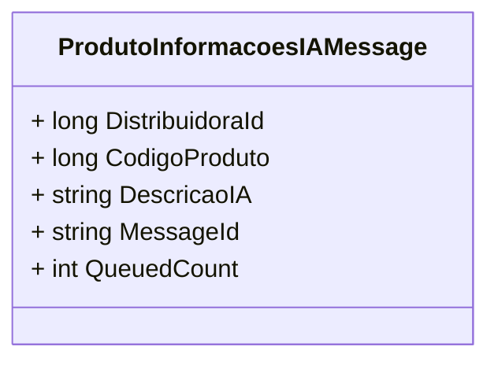

# ProdutoInformacoesIAMessage
**Namespace**: IsthmusWinthor.Dominio.POCO.PesquisaProdutos  
**Nome do Arquivo**: ProdutoInformacoesIAMessage.cs  

## Visão Geral e Responsabilidade
A classe `ProdutoInformacoesIAMessage` representa uma mensagem que transporta informações relacionadas a produtos dentro de um sistema de mensagens baseado em filas. Seu papel é garantir que as informações essenciais, como o código da distribuidora e o código do produto, sejam corretamente encapsuladas e enviadas para consumo em outras partes do sistema. Tal implementação contribui para a integração de sistemas e a troca eficiente de dados sobre produtos.

## Métodos de Negócio
Nenhum método com lógica significativa foi identificado. A classe é composta por propriedades que transporte de dados e não executa lógica de negócio complexa.

## Propriedades Calculadas e de Validação
Nenhuma propriedade com lógica de cálculo ou validação foi identificada. Todas as propriedades são anêmicas.

## Navigations Property
Nenhuma propriedade que se refere a classes complexas do domínio foi identificada nesta classe.

## Tipos Auxiliares e Dependências
- Nenhum enumerador ou classe auxiliar foi identificado para esta classe.

## Diagrama de Relacionamentos

---
Gerada em 29/12/2025 21:48:21
