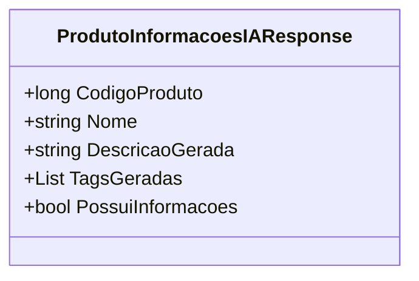

# ProdutoInformacoesIAResponse
**Namespace**: IsthmusWinthor.Dominio.POCO.PesquisaProdutos  
**Nome do Arquivo**: ProdutoInformacoesIAResponse.cs  

## Visão Geral e Responsabilidade
A classe `ProdutoInformacoesIAResponse` serve como um modelo de resposta que encapsula as informações geradas para um produto, utilizando Inteligência Artificial. O principal problema de negócio que esta classe resolve é a necessidade de retornar detalhes necessários sobre um produto, de forma estruturada, após a aplicação de um processamento que gera descrições e tags pertinentes, facilitando a análise e pesquisa de produtos.

## Métodos de Negócio

### Título: PossuiInformacoes (Propriedade)
- **Objetivo**: Garantir que exista uma descrição gerada válida antes de tentar usar as informações do produto.
- **Comportamento**: Esta propriedade retorna um valor booleano que indica se a propriedade `DescricaoGerada` não está vazia ou nula. A lógica é simples: se a descrição gerada existe, retorna `true`; caso contrário, retorna `false`.

### Retorno:
- O valor retornado representa se o produto possui ou não uma descrição gerada, o que pode influenciar como ele é apresentado ou utilizado em outras partes do sistema.

## Propriedades Calculadas e de Validação
- **PossuiInformacoes**: A propriedade válida a existência de uma descrição gerada. Ela assegura que ações subsequentes que dependem da descrição não sejam executadas se esta não estiver disponível.

## Navigations Property
- Não há propriedades que sejam classes complexas do domínio nesta classe.

## Tipos Auxiliares e Dependências
- Não há Enumeradores (Enums) ou Classes Estáticas/Helpers utilizados diretamente por esta classe.

## Diagrama de Relacionamentos

---
Gerada em 29/12/2025 21:48:31
