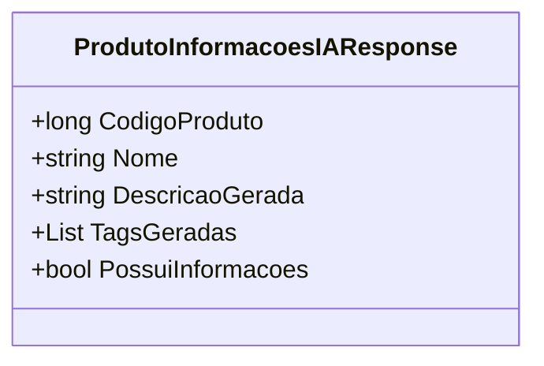

# ProdutoInformacoesIAResponse
- **Namespace**: IsthmusWinthor.Dominio.POCO.PesquisaProdutos
- **Nome do Arquivo**: ProdutoInformacoesIAResponse.cs

## Visão Geral e Responsabilidade
A classe `ProdutoInformacoesIAResponse` é responsável por encapsular as informações geradas por um sistema de inteligência artificial em relação a um produto. Essa classe fornece uma representação estruturada dos dados relevantes, como o código do produto, nome, descrição gerada e tags associadas, permitindo que outros componentes do sistema acessem estas informações de forma organizada. O problema de negócio que ela resolve é a necessidade de apresentar dados de produtos de maneira eficiente e acessível, principalmente quando gerados através de processos automatizados.

## Métodos de Negócio

### Título: PossuiInformacoes (Propriedade)
- **Objetivo**: Verifica se a descrição gerada para o produto está disponível.
- **Comportamento**:
  1. Avalia se a propriedade `DescricaoGerada` não está nula ou vazia.
  2. Retorna `true` caso haja uma descrição válida, caso contrário, retorna `false`.
- **Retorno**: Um valor booleano que indica a presença de informações descritivas sobre o produto.

## Propriedades Calculadas e de Validação
- **PossuiInformacoes**: Esta propriedade computa um valor booleano que reflete a validade da `DescricaoGerada`. Se a descrição estiver disponível (não nula e não vazia), indica que o produto tem informações relevantes. Isso é essencial para o processo de validação em camadas superiores do domínio, onde pode ser necessário garantir que as informações relevantes para um produto foram corretamente geradas.

## Navigations Property
Nenhuma propriedade complexa do domínio foi identificada.

## Tipos Auxiliares e Dependências
Nenhum enumerador ou classe auxiliar foi identificado nesta classe.

## Diagrama de Relacionamentos

