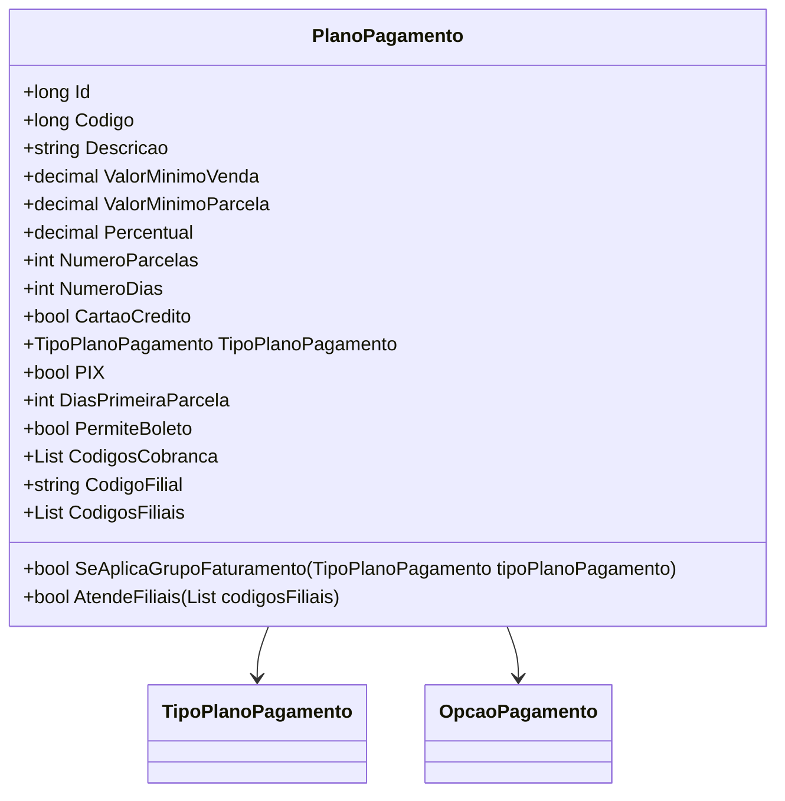

# PlanoPagamento

**Namespace**: IsthmusWinthor.Dominio.POCO  
**Nome do Arquivo**: PlanoPagamento.cs  

## Visão Geral e Responsabilidade
A classe `PlanoPagamento` representa um modelo de domínio que encapsula as regras de negócio relacionadas aos planos de pagamento. Ela é responsável por gerenciar as condições que definem a aceitação de pagamentos e parcelamentos a serem oferecidos aos clientes, possibilitando a avaliação de planos de pagamento com base em critérios como tipos de pagamentos aceitos e grupos de faturamento.

## Métodos de Negócio

### SeAplicaGrupoFaturamento (public)
- **Objetivo**: Verificar se o plano de pagamento se aplica a um grupo de faturamento específico baseado no tipo de plano.
- **Comportamento**: 
  1. Se o `GrupoFaturamento` for "TO", o método retorna `true` imediatamente.
  2. Caso contrário, o método avalia o tipo de plano de pagamento fornecido na entrada:
     - Se for do tipo `Etico`, verifica se o `GrupoFaturamento` é "ET".
     - Se for do tipo `Generico`, verifica se o `GrupoFaturamento` é "GE".
     - Para outros tipos, retorna `false`.
- **Retorno**: Retorna um valor booleano que indica se o tipo de plano de pagamento é aplicável ao grupo de faturamento.

### AtendeFiliais (public)
- **Objetivo**: Determinar se as filiais específicas atendem às condições do plano de pagamento.
- **Comportamento**: 
  1. Se a lista de `codigosFiliais` estiver vazia ou nula, ou se a lista `CodigosFiliais` estiver vazia, o método retorna `true`.
  2. Verifica se `CodigosFiliais` contém `CODIGO_TODAS_FILIAIS`. Se sim, retorna `true`.
  3. Para as filiais fornecidas na lista `codigosFiliais`, o método verifica se todas estão contidas em `CodigosFiliais`. Se todas as filiais estiverem inclusas, retorna `true`; senão, retorna `false`.
- **Retorno**: Retorna um valor booleano indicando se as filiais atendem ao plano de pagamento.

```mermaid
flowchart TD
    A[Início] --> B{GrupoFaturamento = "TO"}
    B -- Sim --> C[Retornar true]
    B -- Não --> D[Verificar TipoPlanoPagamento]
    D --> E{TipoPlanoPagamento == "Etico"}
    E -- Sim --> F[GrupoFaturamento == "ET"]
    F -- Sim --> C
    F -- Não --> G{TipoPlanoPagamento == "Generico"}
    G -- Sim --> H[GrupoFaturamento == "GE"]
    H -- Sim --> C
    H -- Não --> I[Retornar false]
    E -- Não --> J[Retornar false]
```

## Propriedades Calculadas e de Validação

### CodigosFiliais
- **Regra**: Esta propriedade retorna uma lista de códigos de filiais, que são extraídos da string `CodigoFilial`. Se `CodigoFilial` estiver vazio, retorna uma lista vazia. A propriedade também lida com exceções, garantindo a integridade da operação.

## Navigations Property
- [TipoPlanoPagamento](TipoPlanoPagamento.md)

## Tipos Auxiliares e Dependências
- [OpcaoPagamento](OpcaoPagamento.md)
- [TipoPlanoPagamento](TipoPlanoPagamento.md)

## Diagrama de Relacionamentos


---
Gerada em 29/12/2025 21:38:03
