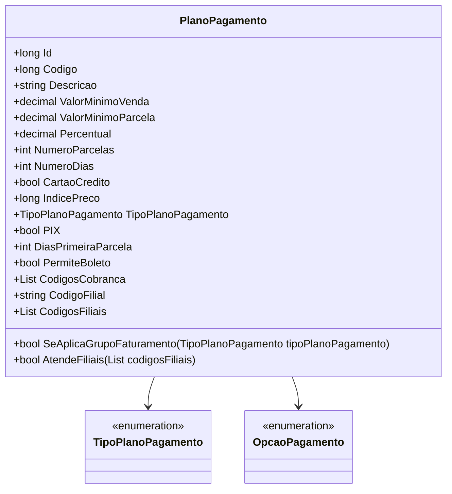

# PlanoPagamento
**Namespace**: IsthmusWinthor.Dominio.POCO  
**Nome do Arquivo**: PlanoPagamento.cs  

## Visão Geral e Responsabilidade
A classe `PlanoPagamento` representa um modelo de domínio responsável pela definição das regras de pagamento de um produto ou serviço. Essa classe resolve o problema de negócio relacionado à estruturação dos planos de pagamento, incluindo detalhes como valores mínimos, número de parcelas, e condições de pagamento para diferentes tipos de clientes e filiais.

## Métodos de Negócio

### SeAplicaGrupoFaturamento | public
**Objetivo**: Garante que um plano de pagamento seja aplicável a um determinado grupo de faturamento com base no tipo de plano de pagamento fornecido.

**Comportamento**:
1. Verifica se `GrupoFaturamento` é igual a "TO". Se sim, retorna `true`, pois se aplica a todos os planos.
2. Em caso contrário, utiliza um `switch` no `tipoPlanoPagamento`.
   - Se `tipoPlanoPagamento` for `TipoPlanoPagamento.Etico`, retorna `true` se `GrupoFaturamento` é igual a "ET".
   - Se `tipoPlanoPagamento` for `TipoPlanoPagamento.Generico`, retorna `true` se `GrupoFaturamento` é igual a "GE".
3. Se nenhum dos casos for verdadeiro, retorna `false`.

**Retorno**: Retorna um valor booleano que indica se o plano se aplica ao grupo de faturamento especificado.

```mermaid
flowchart TD
    A[Início]
    B{GrupoFaturamento == "TO"}
    C{tipoPlanoPagamento}
    D[Verifica se ET]
    E[Verifica se GE]
    F[Fim]
    
    A --> B
    B -- Sim --> F
    B -- Não --> C
    C --> D
    D -- Sim --> F
    D -- Não --> E
    E -- Sim --> F
    E -- Não --> F
```

### AtendeFiliais | public
**Objetivo**: Garante que o plano de pagamento atenda às filiais especificadas.

**Comportamento**:
1. Verifica se `codigosFiliais` ou `CodigosFiliais` estão vazios. Se qualquer uma delas estiver vazia, o método retorna `true`.
2. Verifica se `CodigosFiliais` contém o código especial para "todas as filiais" (`CODIGO_TODAS_FILIAIS`).
3. Se não, verifica se todas as `codigosFiliais` fornecidas estão contidas em `CodigosFiliais`.

**Retorno**: Retorna um valor booleano que indica se o plano de pagamento atende às filiais listadas.

```mermaid
flowchart TD
    A[Início]
    B{codigosFiliais.IsNullOrEmpty()}
    C{CodigosFiliais.IsNullOrEmpty()}
    D{CodigosFiliais contém CODIGO_TODAS_FILIAIS}
    E{Todos os codigosFiliais contidos}
    F[Fim]

    A --> B
    B -- Sim --> F
    B -- Não --> C
    C -- Sim --> F
    C -- Não --> D
    D -- Sim --> F
    D -- Não --> E
    E -- Sim --> F
    E -- Não --> F
```

## Propriedades Calculadas e de Validação
### CodigosFiliais
- **Regra**: Ao acessar `CodigosFiliais`, a propriedade realiza uma validação para garantir que a `CodigoFilial` não está vazia e faz a divisão da string em uma lista de códigos de filial. Se `CodigoFilial` for inválido, retorna uma lista vazia.

## Navigations Property
- **TipoPlanoPagamento**: `[TipoPlanoPagamento](TipoPlanoPagamento.md)`

## Tipos Auxiliares e Dependências
- **Enumeradores**: `[TipoPlanoPagamento](TipoPlanoPagamento.md)`, `[OpcaoPagamento](OpcaoPagamento.md)`

## Diagrama de Relacionamentos


