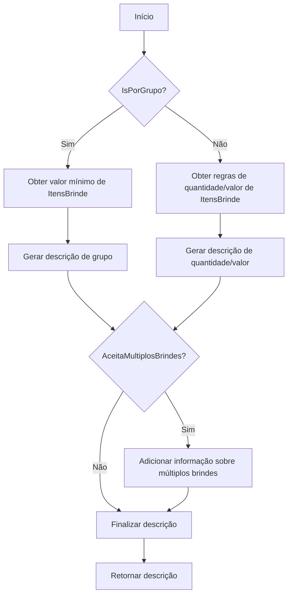
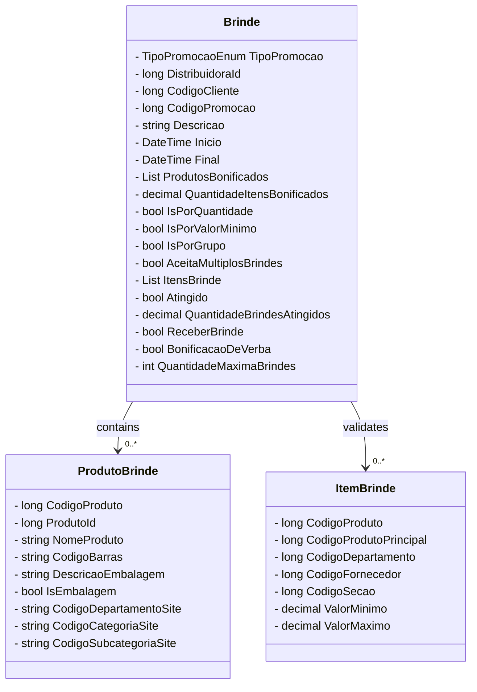

# Brinde

**Namespace**: IsthmusWinthor.Dominio.POCO.Precos  
**Nome do Arquivo**: Brinde.cs  

## Visão Geral e Responsabilidade
A classe `Brinde` representa uma promoção de brinde dentro do sistema. Seu papel é gerenciar as condições e detalhes de uma promoção onde o cliente ganha produtos adicionais baseando-se em critérios específicos de compra. Ela é essencial para as estratégias de marketing, permitindo que as distribuidoras incentivem as vendas através de ofertas atrativas e complexas, adaptadas às regras de negócios estabelecidas pela empresa.

## Métodos de Negócio

### Título: DescricaoCondicao (private)
- **Objetivo**: Gera uma descrição clara das condições da promoção de brinde com base nas regras definidas (como quantidade mínima de compra ou valor mínimo).
- **Comportamento**: 
  1. Verifica se a promoção é baseada em grupo ou em regras de quantidade/valor.
  2. Constrói a string de descrição com críticas personalizadas, utilizando, se necessário, os valores mínimos que devem ser alcançados pelo cliente.
  3. Adiciona detalhes adicionais, se a promoção permitir múltiplos brindes ou se existir um limite máximo de brindes.
- **Retorno**: Uma string descritiva contendo as condições necessárias para o recebimento do brinde. 

## Propriedades Calculadas e de Validação

### Descrição da Propriedade: DescricaoVencimetoPromocao
- **Regra**: Esta propriedade calcula a data de vencimento da promoção. Ela formata a data final (se existir) em um padrão mais legível para o usuário. 

## Navigations Property
- **Produtos Bonificados**: `List<ProdutoBrinde>` que representa os produtos que o cliente pode receber como parte da promoção. [ProdutoBrinde](ProdutoBrinde.md)
- **Itens de Brinde**: `List<ItemBrinde>` que contém os critérios de validação para a promoção. [ItemBrinde](ItemBrinde.md)

## Tipos Auxiliares e Dependências
- **Enumeradores**: `TipoPromocaoEnum` [TipoPromocaoEnum](TipoPromocaoEnum.md)
- **DTO**: `ProdutoDTO` [ProdutoDTO](ProdutoDTO.md)
- **POCO**: `ItemCarrinho` [ItemCarrinho](ItemCarrinho.md)

## Diagrama de Relacionamentos

---
Gerada em 29/12/2025 21:49:25
