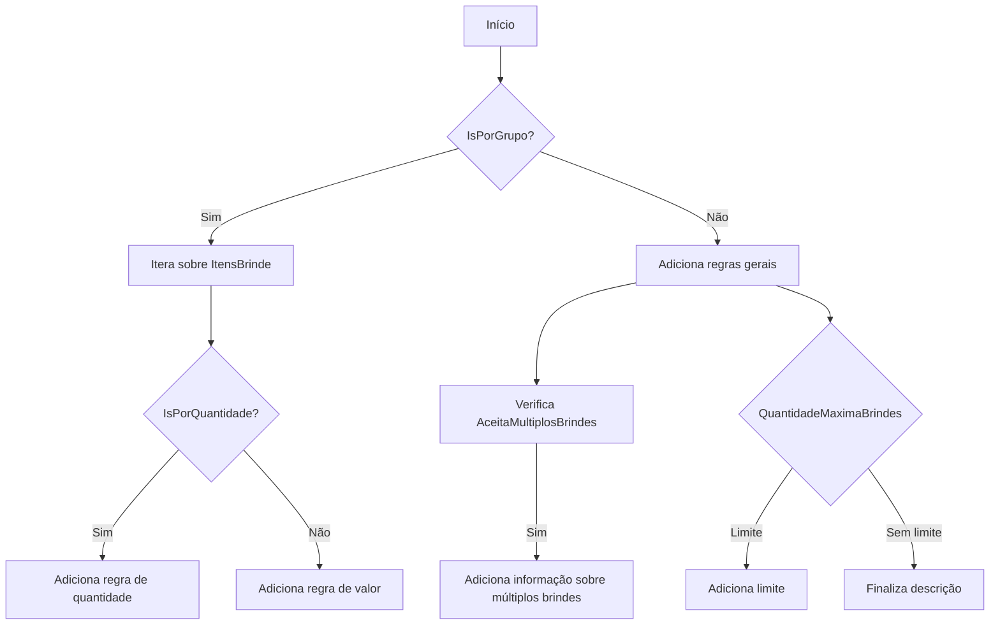
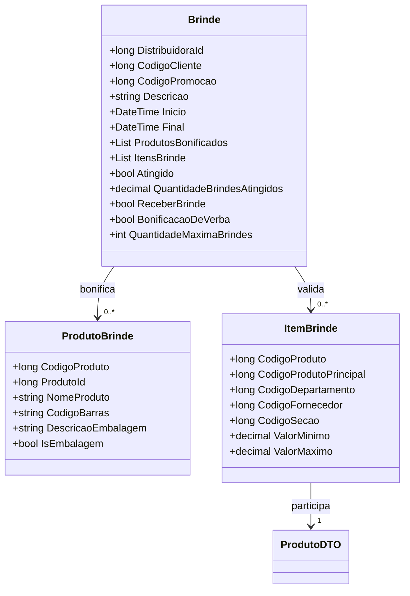

# Brinde
**Namespace**: IsthmusWinthor.Dominio.POCO.Precos  
**Nome do Arquivo**: Brinde.cs

## Visão Geral e Responsabilidade
A classe `Brinde` representa uma promoção do tipo brinde dentro do sistema. Seu principal objetivo é gerenciar as condições e regras que determinam quando um cliente pode receber um produto bonificado ao atingir certos critérios de compra. Isso é essencial para campanhas promocionais, que visam aumentar as vendas e a satisfação do cliente através de incentivos.

## Métodos de Negócio

### Método: `DescricaoCondicao` (Protected)
- **Objetivo**: Gera uma descrição detalhada da condição de promoção para obtenção do brinde.
- **Comportamento**: 
  1. Verifica se a promoção é válida por grupo (`IsPorGrupo`).
  2. Se for por grupo, itera sobre os itens de brinde (`ItensBrinde`), criando uma lista.
  3. Dependendo da condição (por quantidade ou valor), monta uma frase explicativa sobre o mínimo necessário para obter o brinde.
  4. Adiciona informações sobre a aceitação de múltiplos brindes e a quantidade máxima permitida para a mesma promoção.
- **Retorno**: Retorna uma string que detalha as condições para receber o brinde.

## Propriedades Calculadas e de Validação

### Propriedade: `DescricaoVencimetoPromocao` (get)
- **Regra**: Retorna uma string que representa a data final da promoção em um formato legível. Se a data final não estiver definida, retorna uma string vazia.

### Propriedade: `DescricaoCondicaoPromocao` (get)
- **Regra**: Retorna a descrição da condição de promoção, gerada pelo método `DescricaoCondicao()`.

## Navigations Property
- `ProdutosBonificados`: Lista de produtos que são considerados bonificações nesta promoção.
- `ItensBrinde`: Lista de itens da política de brinde que precisam ser validados para apurar se a promoção é aplicável.

### Links
- [`ProdutoBrinde`](ProdutoBrinde.md)
- [`ItemBrinde`](ItemBrinde.md)

## Tipos Auxiliares e Dependências
- `TipoPromocaoEnum`: Enum que representa os tipos de promoção disponíveis.
- `ProdutoDTO`: Classe DTO utilizada para validar se um produto participa da promoção.

### Links
- [`TipoPromocaoEnum`](TipoPromocaoEnum.md)
- [`ProdutoDTO`](ProdutoDTO.md)

## Diagrama de Relacionamentos

