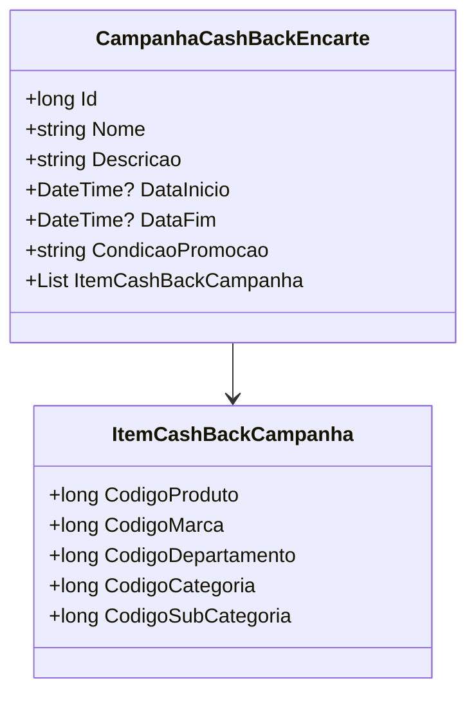

# CampanhaCashBackEncarte
**Namespace**: IsthmusWinthor.Dominio.POCO.Precos  
**Nome do Arquivo**: CampanhaCashBackEncarte.cs  

## Visão Geral e Responsabilidade
A classe `CampanhaCashBackEncarte` representa uma promoção do tipo cashback no sistema, permitindo que os clientes recebam de volta uma porcentagem do valor gasto em compras de produtos específicos. Esta classe é fundamental para a implementação de estratégias de marketing e atração de clientes, além de oferecer uma forma de fidelização através de benefícios financeiros. Assim, ela facilita o acompanhamento e a gestão de campanhas promocionais com base nas condições estabelecidas.

## Métodos de Negócio
### Título: TipoPromocao (Acessor de Leitura)
- **Objetivo**: Retornar o tipo da promoção, que neste caso é `TipoPromocaoEnum.CashBack`.
- **Comportamento**: Este método não contém lógica condicional, sendo simplesmente uma propriedade que retorna um valor fixo do enumerador.
- **Retorno**: Retorna um valor do tipo `TipoPromocaoEnum`, indicando que a promoção é do tipo cashback.

### Título: CodigoPromocao (Acessor de Leitura)
- **Objetivo**: Fornecer o código da promoção que será utilizado ao transpor a `CampanhaCashBackEncarte` para a entidade `PromocaoEncarte`.
- **Comportamento**: Retorna o valor do identificador (`Id`) da campanha.
- **Retorno**: Retorna um `long`, que é o identificador da promoção.

## Propriedades Calculadas e de Validação
- **TipoPromocao**: Esta propriedade é uma representação fixa do tipo de promoção. Não há lógica de validação, mas garante que este modelo de promoção sempre será identificado corretamente como cashback.
- **CodigoPromocao**: Relaciona-se diretamente ao `Id`, servindo para assegurar que o código da promoção esteja sempre associado à instância correta.

## Navegations Property
- **ItemCashBackCampanha**: Esta propriedade é uma lista de `ItemCashBackCampanha`. Cada item dessa lista representa um produto que participa da campanha de cashback.  
  O link presumido para a classe: [ItemCashBackCampanha](ItemCashBackCampanha.md).

## Tipos Auxiliares e Dependências
- **Enumeradores**: 
  - [TipoPromocaoEnum](TipoPromocaoEnum.md). Este enumerador define os tipos de promoção disponíveis no sistema.

## Diagrama de Relacionamentos

---
Gerada em 29/12/2025 21:49:41
