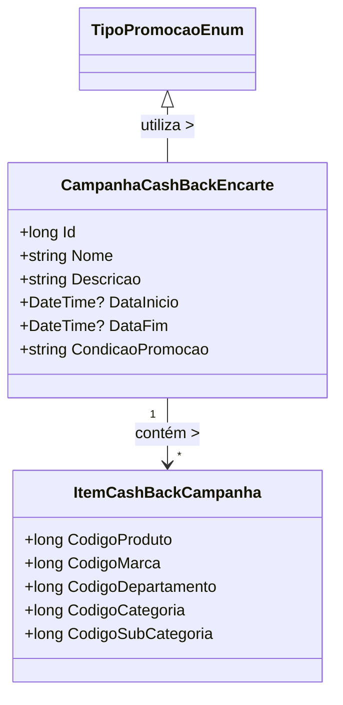

# CampanhaCashBackEncarte
**Namespace**: IsthmusWinthor.Dominio.POCO.Precos  
**Nome do Arquivo**: CampanhaCashBackEncarte.cs  

## Visão Geral e Responsabilidade
A classe `CampanhaCashBackEncarte` representa uma promoção do tipo cashback. O intuito desta classe é encapsular os detalhes de uma campanha de cashback, que reembolsa ao cliente uma porcentagem ou valor fixo em suas compras, condicionados a um período específico e a itens participantes. A classe trata das regras que regem a promoção, incluindo a definição de condições e o gerenciamento dos itens que se qualificam para a promoção.

## Métodos de Negócio
**Título**: `TipoPromocao` (getter)  
**Objetivo**: Garante que a promoção é do tipo cashback.  
**Comportamento**: Retorna um enum que representa o tipo da promoção, especificamente `TipoPromocaoEnum.CashBack`.  
**Retorno**: Retorna o tipo de promoção especificado como cashback.

**Título**: `CodigoPromocao` (getter)  
**Objetivo**: Fornece um identificador único para a promoção baseada no ID.  
**Comportamento**: Retorna o valor da propriedade `Id`, que representa o código da promoção dentro do sistema.  
**Retorno**: Um número longo que representa o código da promoção.

## Propriedades Calculadas e de Validação
- **Id**: Não possui validação explícita, mas deve ser assegurado que este ID é único em relação a outras campanhas no sistema.
- **DataInicio** e **DataFim**: Devem ser validáveis para garantir que as datas estejam em uma lógica correta (Data de início não deve ser posterior à data de fim).

## Navigation Property
- **ItemCashBackCampanha**: 
  - Representa a coleção de itens que participam da campanha. Cada item é uma instância da classe `[ItemCashBackCampanha](ItemCashBackCampanha.md)`.

## Tipos Auxiliares e Dependências
- **Enums**: 
  - `[TipoPromocaoEnum](TipoPromocaoEnum.md)`: Enum que define os tipos de promoções disponíveis no sistema.

## Diagrama de Relacionamentos

Esta documentação sintetiza o papel de `CampanhaCashBackEncarte` no sistema, bem como suas propriedades e interações com outras classes do domínio, promovendo uma visão clara e organizada das regras de negócio envolvidas.
