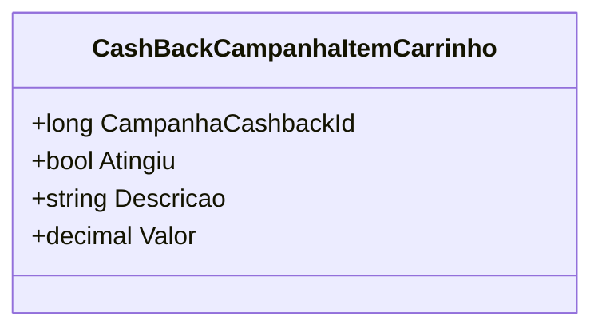

# CashBackCampanhaItemCarrinho
**Namespace**: IsthmusWinthor.Dominio.POCO.Precos  
**Nome do Arquivo**: CashBackCampanhaItemCarrinho.cs  

## Visão Geral e Responsabilidade
A classe `CashBackCampanhaItemCarrinho` representa um item de campanha de cashback aplicável a um carrinho de compras. Seu papel é gerenciar as informações relativas a campanhas de cashback, especialmente na aplicação de valores baseados na execução de determinadas condições, sendo essencial para garantir que as regras de ofertas e promoções sejam corretamente aplicadas e que os clientes recebam o cashback conforme esperado. A classe é projetada para resolver o problema de garantir a integridade das informações de campanhas de cashback no processo de compra.

## Métodos de Negócio
*Este trecho não contém métodos de negócio com lógica complexa ou comportamentos que necessitem de descrição adicional. Assim, não há métodos a serem listados nesta seção.*

## Propriedades Calculadas e de Validação
- *Nenhuma propriedade com lógica de cálculo ou validação foi identificada nesta classe.*

## Navigations Property
- *Não há propriedades que são classes complexas do domínio nesta classe.*

## Tipos Auxiliares e Dependências
- *Nenhum Enumerador ou Classe Estática/Helpers utilizado nesta classe.*

## Diagrama de Relacionamentos

