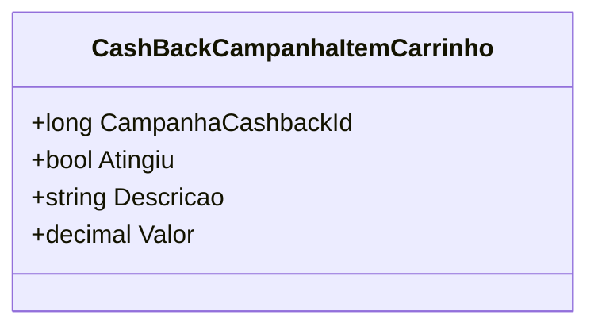

# CashBackCampanhaItemCarrinho
**Namespace**: IsthmusWinthor.Dominio.POCO.Precos  
**Nome do Arquivo**: CashBackCampanhaItemCarrinho.cs  

## Visão Geral e Responsabilidade
A classe `CashBackCampanhaItemCarrinho` representa um item de campanha de cashback que é aplicado em um carrinho de compras. Ela é responsável por gerenciar e armazenar informações relacionadas a uma campanha específica de cashback, indicando se a campanha foi atingida e qual o valor do cashback a ser recebido. Seu papel é garantir que as regras de negócio associadas ao cashback sejam devidamente aplicadas e gerenciadas ao longo do processo de checkout.

## Métodos de Negócio
Não há métodos de negócio complexos implementados nesta classe. Esta classe atua principalmente como um objeto de transporte de dados.

## Propriedades Calculadas e de Validação
- **Atingiu**: Propriedade que indica se a meta da campanha de cashback foi atingida.
  - **Regra**: A campanha deve ser considerada válida (atingida) quando as condições predefinidas para a aplicação do cashback forem cumpridas. Este valor deve ser ajustado em conformidade com a lógica do sistema durante o processamento da campanha.

## Navigations Property
- Não existem propriedades complexas do domínio ou navigations properties nesta classe.

## Tipos Auxiliares e Dependências
- Não há enumeradores ou classes estáticas/helpers associadas diretamente à classe `CashBackCampanhaItemCarrinho`.

## Diagrama de Relacionamentos

Esta documentação captura as principais características e responsabilidades da classe `CashBackCampanhaItemCarrinho`, permitindo um entendimento claro de suas regras de negócio e estrutura dentro da aplicação.
---
Gerada em 29/12/2025 21:49:51
