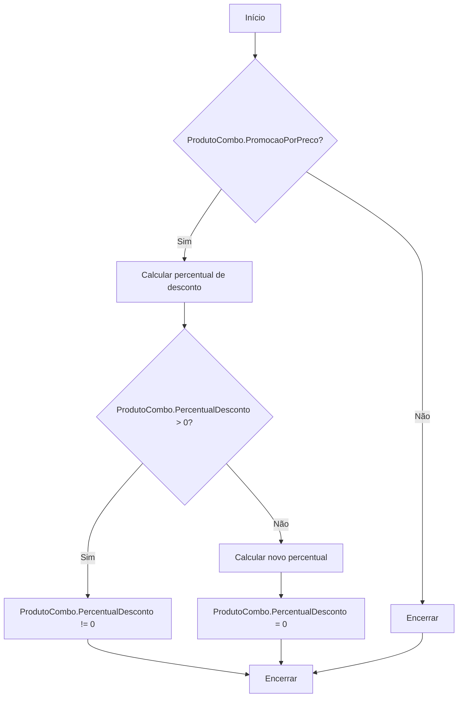
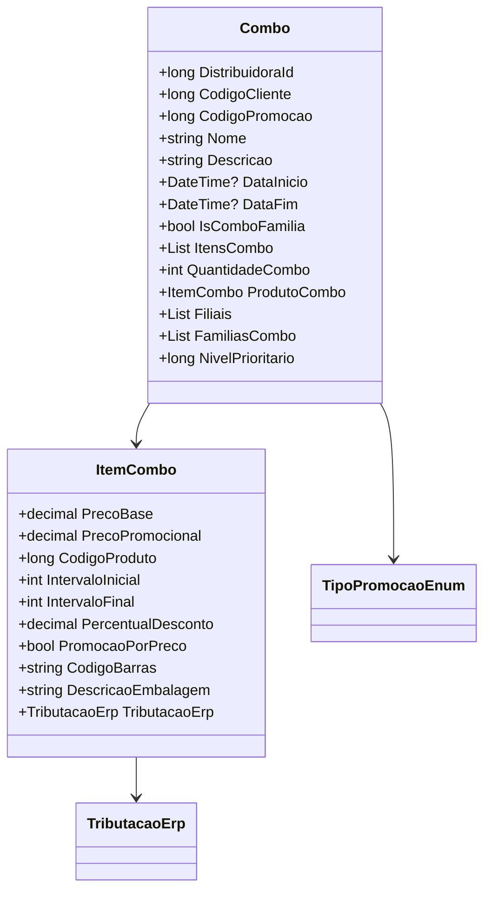

# Combo

**Namespace**: IsthmusWinthor.Dominio.POCO.Precos  
**Nome do Arquivo**: Combo.cs  

## Visão Geral e Responsabilidade
A classe `Combo` representa uma promoção do tipo "combo", onde são oferecidos múltiplos itens mediante condições específicas. O problema de negócio que ela resolve é a aplicação de regras de promoção complexas que podem variar com base no tipo de produto, quantidade e condições estabelecidas para ativação das promoções, permitindo uma gestão mais eficaz das ofertas de venda.

## Métodos de Negócio

### CalcularPercentualDesconto (public)
- **Objetivo**: Calcula o percentual de desconto para a promoção, se aplicável.
- **Comportamento**: 
  1. Verifica se o produto tem uma promoção por preço.
  2. Se sim, calcula o percentual de desconto com base no preço de venda do cliente e no preço promocional.
  3. Atualiza o percentual de desconto no produto, garantindo que não seja negativo.
- **Retorno**: Não há valor retornado; o método modifica o estado do objeto `ProdutoCombo`.

### AplicarCondicaoPharmalink (public)
- **Objetivo**: Aplica condições de desconto da promoção Pharmalink a um `ItemCombo` e a todos os itens do combo.
- **Comportamento**: 
  1. Altera o desconto e a quantidade de casas decimais do `ProdutoCombo`.
  2. Aplica as mesmas condições a cada item em `ItensCombo`.
- **Retorno**: Não há valor retornado; o método modifica o estado dos itens do combo.

### AplicarCondicaoIsthmusIndustria (public)
- **Objetivo**: Aplica condições de desconto relacionadas à indústria para o `ItemCombo` e todos os itens do combo.
- **Comportamento**: 
  1. Altera o valor do desconto e a quantidade de casas decimais do `ProdutoCombo`.
  2. Itera sobre `ItensCombo` para aplicar a mesma condição.
- **Retorno**: Não há valor retornado; o método modifica o estado dos itens do combo.

## Propriedades Calculadas e de Validação

### DescricaoVencimetoPromocao
- **Regra**: Retorna uma string formatada que indica a data de vencimento da promoção, se disponível, ou uma string vazia. Essa propriedade é útil para exibir informações ao cliente sobre a validade da oferta.

### DescricaoCondicaoPromocao
- **Regra**: Gera uma descrição detalhada sobre as condições necessárias para ativar a promoção do combo. Se for um "combo família", inclui as condições específicas, caso contrário menciona que é preciso adquirir todos os itens.

## Navigations Property

- `ProdutoCombo`: `[ItemCombo](ItemCombo.md)` - Item do Combo associado ao produto específico.
- `ItensCombo`: Presume-se que cada `ItemCombo` é uma instância da classe de domínio que representa um item dentro do combo.

## Tipos Auxiliares e Dependências

- `TipoPromocaoEnum`: `[TipoPromocaoEnum](TipoPromocaoEnum.md)` - Enum utilizado para definir o tipo de promoção.
- `ItemCombo`: `[ItemCombo](ItemCombo.md)` - Classe que representa cada item dentro de um combo.
- `TributacaoErp`: Classe que representa a tributação dos produtos.

## Diagrama de Relacionamentos

Esta documentação proporciona uma visão técnica clara sobre a implementação da classe `Combo`, suas regras de negócio, e como as diferentes propriedades e métodos interagem entre si e com outras classes do domínio.
