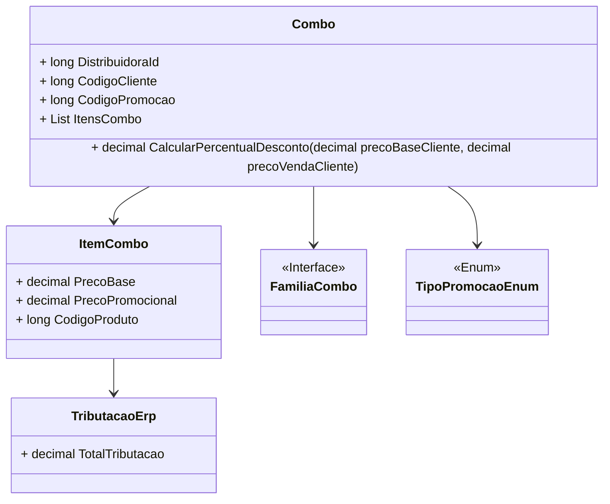

# Combo
**Namespace**: IsthmusWinthor.Dominio.POCO.Precos  
**Nome do Arquivo**: Combo.cs  

## Visão Geral e Responsabilidade
A classe `Combo` representa uma promoção que agrupa produtos em um único pacote com condições específicas para desconto. Esta classe esclarece como promoções complexas são aplicadas a produtos, levando em consideração regras de negócio que impactam a venda. O problema de negócio que ela resolve é fornecer uma forma de agrupar vendas e aplicar descontos de forma condicional baseada em itens no carrinho de compras ou regras de família de produtos.

## Métodos de Negócio

### CalcularPercentualDesconto - `public void`
- **Objetivo**: Garantir que o percentual de desconto aplicado ao produto referenciado seja corretamente calculado com base no preço de venda do cliente.
- **Comportamento**: 
  1. Verifica se a promoção é do tipo "por preço".
  2. Se sim, calcula o percentual de desconto:
     - Se já existe um percentual de desconto definido, preserva-o.
     - Caso contrário, calcula o percentual com base na diferença entre o preço de venda e o preço promocional, normalizando pelo preço de venda.
  3. Garante que o percentual de desconto não seja negativo.
- **Retorno**: Este método não retorna valor, mas altera o estado do objeto `ProdutoCombo` ao definir o percentual de desconto.

### AplicarCondicaoPharmalink - `public void`
- **Objetivo**: Ajustar as condições da promoção de acordo com os parâmetros específicos do `Pharmalink`.
- **Comportamento**:
  1. Aplica o desconto definido de Pharmalink ao `ProdutoCombo`.
  2. Realiza a aplicação nos itens do combo, iterando sobre cada um e chamando o método correspondente.
- **Retorno**: Não retorna valor, modifica o estado dos itens internos.

### AplicarCondicaoIsthmusIndustria - `public void`
- **Objetivo**: Ajustar as condições da promoção de acordo com os parâmetros específicos da `IsthmusIndustria`.
- **Comportamento**:
  1. Aplica o desconto definido da indústria ao `ProdutoCombo`.
  2. Realiza a aplicação nos itens do combo, iterando sobre cada um e chamando o método correspondente.
- **Retorno**: Não retorna valor, modifica o estado dos itens internos.

## Propriedades Calculadas e de Validação

### DescricaoVencimetoPromocao
- **Regra**: A descrição do vencimento da promoção é calculada com base na data de fim da promoção. Se a data não estiver definida, retorna uma string vazia. Essa propriedade fornece uma clara compreensão do período de validade da promoção.

### DescricaoCondicaoPromocao
- **Regra**: Fornece uma descrição detalhada das condições da promoção, dependendo se a promoção é por família ou não. As condições são calculadas com base na existência de itens específicos e quantidades requeridas.

## Navigation Property

- [ItemCombo](ItemCombo.md): Representa cada produto individual dentro do combo e suas condições específicas.
- [FamiliaCombo](FamiliaCombo.md): Representa as famílias de produtos que podem ser incluídas no combo, caso a promoção seja por família.

## Tipos Auxiliares e Dependências

- [TipoPromocaoEnum](TipoPromocaoEnum.md): Enumeração que representa os tipos de promoção disponíveis no sistema.
- [TributacaoErp](TributacaoErp.md): Classe que representa as regras de tributação aplicáveis ao produto.

## Diagrama de Relacionamentos

---
Gerada em 29/12/2025 21:50:11
