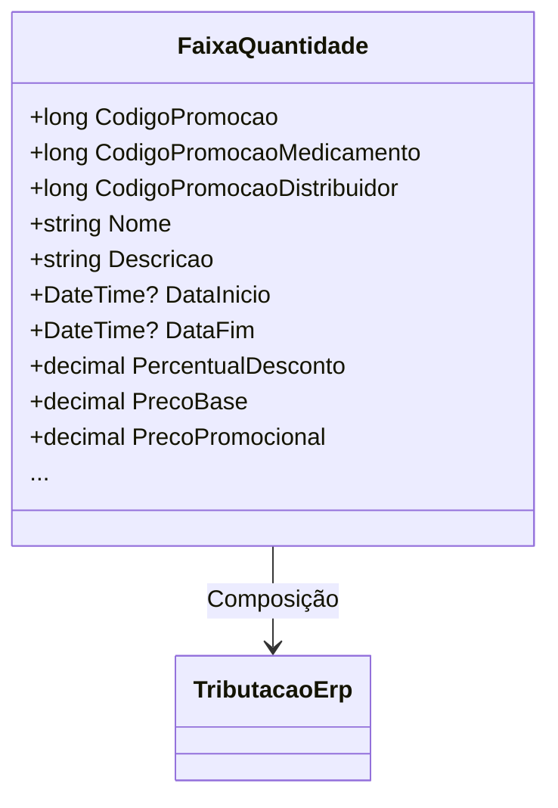

# FaixaQuantidade
- **Namespace**: IsthmusWinthor.Dominio.POCO.Precos
- **Nome do Arquivo**: FaixaQuantidade.cs

## Visão Geral e Responsabilidade
A classe `FaixaQuantidade` representa uma promoção associada a um intervalo de quantidade de um produto específico. Esta classe é essencial para o faturamento em cenários onde as promoções variam de acordo com a quantidade adquirida. Ela resolve o problema de calcular preços promocionais, considerando diferentes níveis de desconto e intervalos de quantidade, assegurando que o preço final a ser apresentado aos clientes esteja correto e de acordo com as regras de negócio da empresa.

## Métodos de Negócio

### GetPrecoPromocional
- **Título**: `private decimal GetPrecoPromocional()`
- **Objetivo**: Garante que o preço promocional seja calculado corretamente com base no desconto aplicável (Pharmalink, Isthmus Industria ou padrão).
- **Comportamento**:
  1. Verifica se existe um desconto aplicável da Pharmalink.
     - Se sim, chama `CalcularPrecoPromocionalComDescontoPharmalink()`.
  2. Se não, verifica se existe um desconto da Isthmus Industria.
     - Se sim, chama `CalcularPrecoPromocionalComDescontoIsthmusIndustria()`.
  3. Se não houver descontos, chama `CalcularPrecoPromocional()`.
- **Retorno**: Retorna o preço promocional final após a aplicação dos descontos.

```mermaid
flowchart TD
    A[Início] --> B{Existe desconto Pharmalink?}
    B -- Sim --> C[CalcularPrecoPromocionalComDescontoPharmalink()]
    B -- Não --> D{Existe desconto Isthmus Industria?}
    D -- Sim --> E[CalcularPrecoPromocionalComDescontoIsthmusIndustria()]
    D -- Não --> F[CalcularPrecoPromocional()]
```

### AplicarDescontoProduto
- **Título**: `public void AplicarDescontoProduto(decimal precoBaseCliente, int quantidadeCasasDecimais)`
- **Objetivo**: Calcula e aplica o desconto ao preço base do cliente, a partir de um percentual de desconto.
- **Comportamento**:
  1. Calcula a quantidade de casas decimais do preço base.
  2. Aplica a fórmula de desconto sobre o preço base do cliente.
  3. Armazena o preço com desconto na propriedade `PrecoBase`.
- **Retorno**: Não retorna valor, mas modifica o estado da propriedade `PrecoBase`.

### AplicarCondicaoPharmalink
- **Título**: `public void AplicarCondicaoPharmalink(decimal descontoPharmalink, int quantidadeCasasDecimais)`
- **Objetivo**: Configura o desconto Pharmalink e a quantidade de casas decimais a serem utilizadas nos cálculos.
- **Comportamento**: Armazena o valor do desconto e a quantidade de casas decimais nos campos privados da classe.

### AplicarCondicaoIsthmusIndustria
- **Título**: `public void AplicarCondicaoIsthmusIndustria(decimal valorDesconto, int quantidadeCasasDecimais)`
- **Objetivo**: Configura o desconto da Isthmus Industria e a quantidade de casas decimais a serem utilizadas nos cálculos.
- **Comportamento**: Armazena o valor do desconto e a quantidade de casas decimais nos campos privados da classe.

## Propriedades Calculadas e de Validação

### PrecoPromocional
- **Propriedade**: `public decimal PrecoPromocional`
- **Regra**: Calcula o preço promocional a partir do preço base e da tributação. Este valor é atualizado sempre que a lógica de preços é acionada.

### DescricaoVencimetoPromocao
- **Propriedade**: `public string DescricaoVencimetoPromocao`
- **Regra**: Retorna uma string que representa a data de término da promoção, formatada como "Até [data]".

## Navigation Property
- **TributacaoErp**: Classe relacionada que contêm informações sobre as tributações aplicadas. 
  - Link: `[TributacaoErp](TributacaoErp.md)`

## Tipos Auxiliares e Dependências
- **Enums**: 
  - `[TributacaoErp](TributacaoErp.md)` (assumido baseado no contexto)

## Diagrama de Relacionamentos


Esta documentação cobre a lógica de negócios da classe `FaixaQuantidade`, detalhando como ela opera em termos de cálculos de desconto e promoção. A estrutura foi formulada para assegurar que usuários e desenvolvedores tenham uma compreensão clara de suas operações e como se relaciona com outros elementos do domínio.
