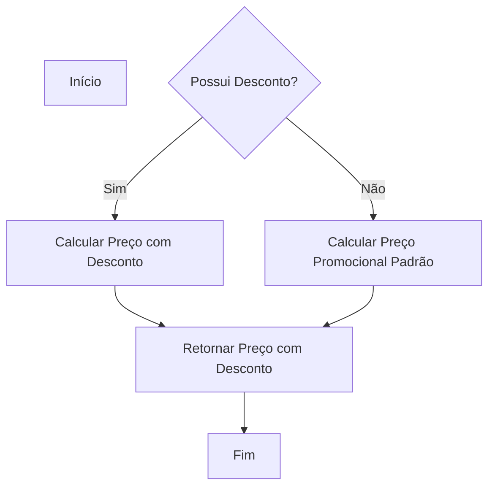
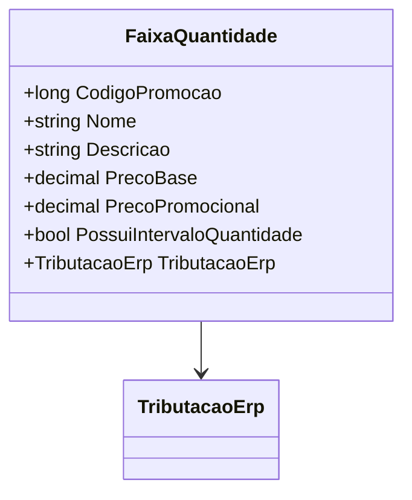

# FaixaQuantidade
**Namespace**: IsthmusWinthor.Dominio.POCO.Precos  
**Nome do Arquivo**: FaixaQuantidade.cs  

## Visão Geral e Responsabilidade
A classe `FaixaQuantidade` representa uma promoção de faixa de quantidade específica para um produto. É responsável por calcular preços promocionais com base em diferentes condições de desconto e apresentar informações relevantes sobre a promoção. Essa classe é essencial para garantir que as promoções sejam aplicadas corretamente, permitindo que os negócios ajustem preços de forma dinâmica e informem os clientes sobre as condições de cada promoção.

## Métodos de Negócio

### 1. `GetPrecoPromocional` - `private`
**Objetivo**: Garante que o preço promocional seja calculado corretamente com base nas condições de desconto aplicáveis.  
**Comportamento**:
- Verifica se existe desconto via Pharmalink.
- Caso haja, chama o método correspondente para calcular o preço promocional.
- Se não, checa se existe desconto via Isthmus Industria e novamente chama o método apropriado.
- Se nenhum desconto estiver presente, utiliza o método padrão para cálculo do preço promocional.
**Retorno**: Retorna o preço promocional final com base nas condições e descontos aplicáveis.

### 2. `AplicarDescontoProduto` - `public`
**Objetivo**: Atualiza o preço base do cliente aplicando o percentual de desconto calculado.  
**Comportamento**:
- Determina a quantidade de casas decimais necessárias para o preço usando a lógica interna.
- Aplica o desconto ao preço base do cliente, arredondando o valor corretamente.
**Retorno**: Este método não retorna um valor, mas atualiza a propriedade `PrecoBase`.

### 3. `AplicarCondicaoPharmalink` - `public`
**Objetivo**: Aplica o desconto específico da Pharmalink para o cálculo do preço que será retornado.  
**Comportamento**:
- Atualiza o valor do desconto Pharmalink e a quantidade de casas decimais usadas para essa operação.
**Retorno**: Este método não retorna um valor.

### 4. `AplicarCondicaoIsthmusIndustria` - `public`
**Objetivo**: Aplica o desconto da Isthmus Industria que é usado no cálculo do preço.  
**Comportamento**:
- Similar ao método anterior, atualiza o valor do desconto correspondiente e a quantidade de casas decimais.
**Retorno**: Este método não retorna um valor.

### 5. `DescricaoQuantidade` - `private`
**Objetivo**: Fornece uma descrição textual das condições da promoção, levando em consideração valores mínimos e máximos.  
**Comportamento**:
- Constrói uma string que descreve as condições de quantidade, validando se as propriedades associadas possuem valores que alteram a descrição final.
**Retorno**: Retorna uma string com a descrição das condições da promoção.

## Propriedades Calculadas e de Validação
### `PrecoPromocional`
- **Regra**: Calcula o preço promocional aplicando potencialmente dois tipos de desconto (Pharmalink e Isthmus Industria) e adicionando tributações aplicáveis.

### `DescricaoVencimetoPromocao`
- **Regra**: Retorna uma string que indica a data de fim da promoção, caso definida.

## Navigations Property
- [TributacaoErp](TributacaoErp.md)

## Tipos Auxiliares e Dependências
- [TributacaoErp](TributacaoErp.md)

## Diagrama de Relacionamentos

---
Gerada em 29/12/2025 21:50:28
