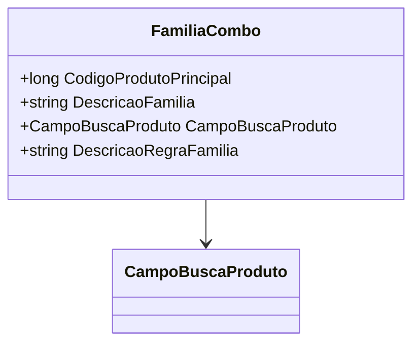

# FamiliaCombo
**Namespace**: IsthmusWinthor.Dominio.POCO.Precos  
**Nome do Arquivo**: FamiliaCombo.cs  

## Visão Geral e Responsabilidade
A classe `FamiliaCombo` representa uma configuração de uma família de produtos em um sistema de preços. Seu papel é agrupar informações relacionadas a um produto principal e suas regras associadas, facilitando a busca e organização de combos de produtos. Isso resolve a necessidade de definir e classificar produtos em grupos coerentes para marketing e precificação.

## Propriedades Calculadas e de Validação
- **CampoBuscaProduto**: Esta propriedade fornece um valor fixo do enumerador `CampoBuscaProduto` que representa a maneira como o produto principal será buscado. A regra por trás dessa propriedade é garantir que o método de busca utilize sempre o código do produto principal para referências e operações de pesquisa.

## Navigations Property
- Não há propriedades complexas de navegação nesta classe.

## Tipos Auxiliares e Dependências
- [CampoBuscaProduto](CampoBuscaProduto.md): Enum que define os campos de busca disponíveis para produtos.

## Diagrama de Relacionamentos

---
Gerada em 29/12/2025 21:50:35
