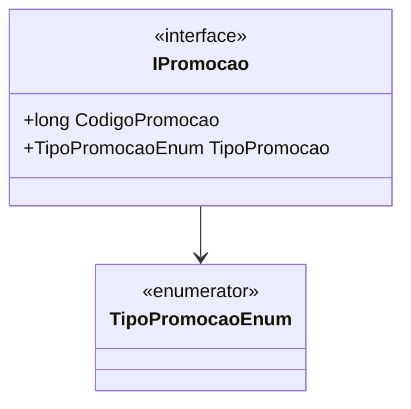

# IPromocao
**Namespace**: IsthmusWinthor.Dominio.POCO.Precos  
**Nome do Arquivo**: IPromocao.cs  

Esta interface representa uma promoção, atuando como um contrato para classes que implementam suas regras de negócio de promoções disponíveis.

## Propriedades
- `long CodigoPromocao`: Identifica de forma única uma promoção específica. É uma propriedade de acesso somente leitura.
- `TipoPromocaoEnum TipoPromocao`: Indica o tipo da promoção, definido por um enumerador. Esta propriedade também é de acesso somente leitura.

## Tipos Auxiliares e Dependências
- `[TipoPromocaoEnum](TipoPromocaoEnum.md)`: Enum que define os possíveis tipos de promoção que podem ser associados à implementação da interface `IPromocao`.

## Diagrama de Relacionamentos

