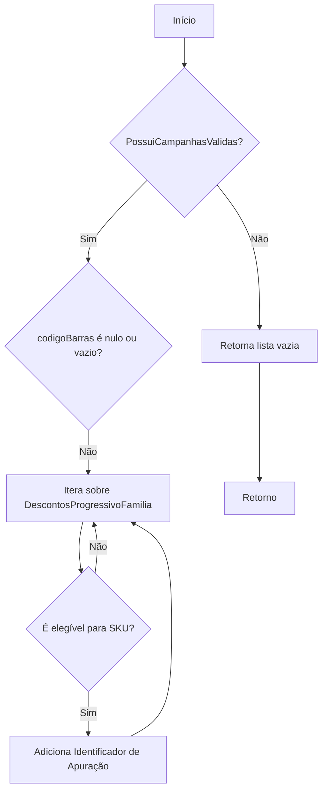
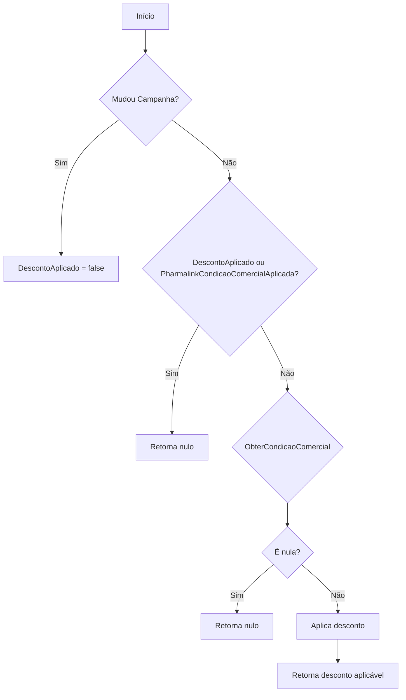
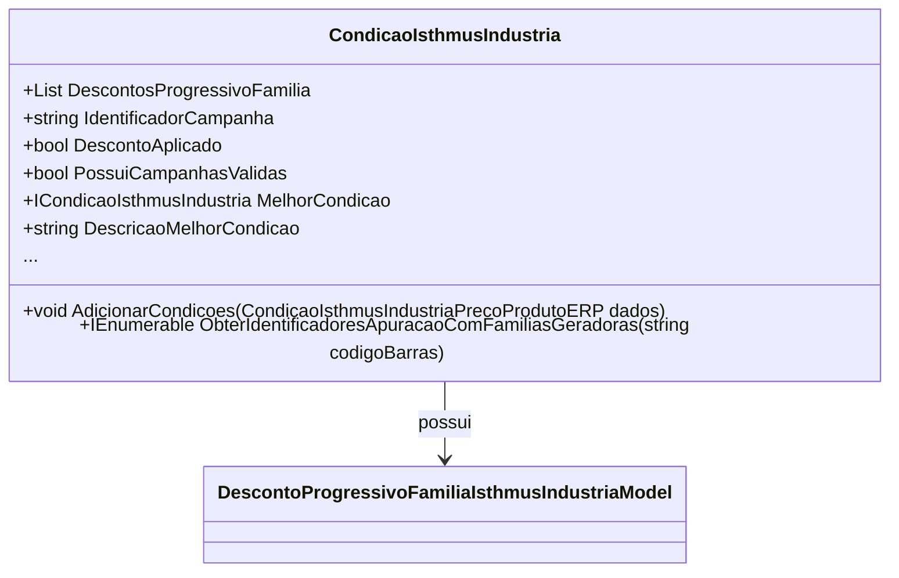

# CondicaoIsthmusIndustria

- **Namespace**: IsthmusWinthor.Dominio.POCO.Precos.IsthmusIndustrias
- **Nome do Arquivo**: CondicaoIsthmusIndustria.cs

## Visão Geral e Responsabilidade
A classe `CondicaoIsthmusIndustria` atua como um motor de cálculo para aplicar condições comerciais relacionadas a descontos progressivos de famílias em um ambiente de e-commerce. Ela gerencia as condições de desconto para diferentes campanhas e é responsável por calcular o melhor preço aplicável, garantindo que as regras de negócio sejam seguidas ao aplicar promoções. Essa classe é crucial para a integridade dos dados financeiros durante o processo de checkout, uma vez que assegura que os usuários tenham acesso aos descontos mais vantajosos disponíveis.

## Métodos de Negócio

### Título: `AdicionarCondicoes` (public)
- **Objetivo**: Adiciona as condições de desconto progressivo de um produto à lista de condições disponíveis.
- **Comportamento**: 
  1. Chama o método privado `ResetCondicoes` para limpar condições previamente existentes.
  2. Adiciona as condições de desconto recebidas através do parâmetro `dados.DescontoProgressivoFamilia`.
- **Retorno**: Não possui retorno.

### Título: `ObterIdentificadoresApuracaoComFamiliasGeradoras` (public)
- **Objetivo**: Recupera identificadores de apuração para campanhas válidas associadas a um código de barras específico.
- **Comportamento**:
  1. Verifica se existem campanhas válidas e se o código de barras não é nulo ou vazio.
  2. Itera sobre a lista de descontos progressivos para coletar identificadores de apuração de campanhas geradoras que são elegíveis para o SKU fornecido.
  3. Filtra e retorna uma lista de identificadores distintos.
- **Retorno**: Uma lista de strings contendo identificadores de apuração.

### Título: `CalcularMelhorPreco` (public)
- **Objetivo**: Calcula o melhor preço após aplicar a condição comercial vigente para um dado cliente.
- **Comportamento**:
  1. Invoca o método `CalcularMelhorPreco` da melhor condição atual, passando o preço do cliente como parâmetro.
  2. Retorna o resultado desse cálculo.
- **Retorno**: Um modelo que representa a melhor condição comercial de preço.

### Título: `AplicarCondicaoComercial` (public)
- **Objetivo**: Aplica a condição comercial para exibição no cartão de produto.
- **Comportamento**:
  1. Verifica se a campanha escolhida foi alterada, definindo `DescontoAplicado` como falso caso tenha mudado.
  2. Verifica se um desconto já foi aplicado ou se outra condição comercial já está ativa. Caso verdadeiro, retorna nulo.
  3. Determina a condição comercial a ser aplicada.
  4. Se a condição for válida, aplica o desconto nos vários componentes do preço do produto.
- **Retorno**: Retorna um modelo de desconto aplicável, ou nulo se não houver desconto.

## Propriedades Calculadas e de Validação

### Propriedade: `PossuiCampanhasValidas`
- **Regra**: Indica se a listagem de descontos progressivos tem pelo menos uma condição válida.

### Propriedade: `MelhorCondicao`
- **Regra**: Retorna a melhor condição entre os descontos progressivos válidos. O cálculo é baseado em regras específicas de prioridade entre as campanhas associadas.

## Navigations Property
- `[DescontoProgressivoFamiliaIsthmusIndustriaModel](DescontoProgressivoFamiliaIsthmusIndustriaModel.md)`

## Tipos Auxiliares e Dependências
- Enumeradores:
  - `[TipoPromocaoEnum](TipoPromocaoEnum.md)`
- Classes Estáticas/Helpers não listadas - dependências de bibliotecas externas.

## Diagrama de Relacionamentos

Essa documentação deve proporcionar uma visão clara sobre as regras de negócio que a classe `CondicaoIsthmusIndustria` implementa, assegurando que o entendimento e a integridade dos dados sejam mantidos durante a aplicação das condições comerciais.
