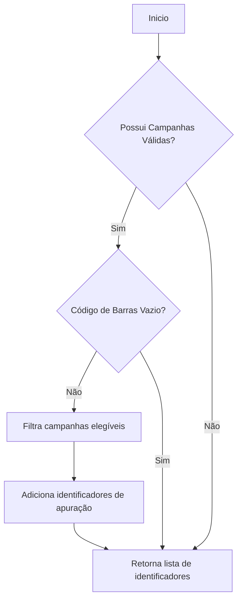
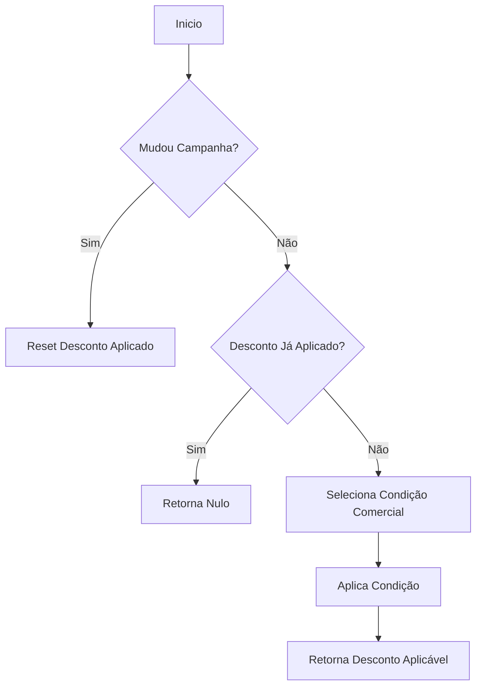
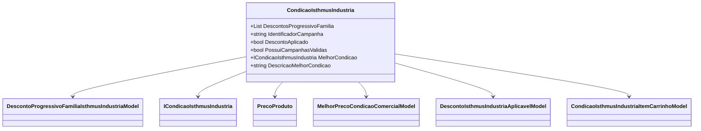

# CondicaoIsthmusIndustria
**Namespace**: IsthmusWinthor.Dominio.POCO.Precos.IsthmusIndustrias  
**Nome do Arquivo**: CondicaoIsthmusIndustria.cs

## Visão Geral e Responsabilidade
A classe `CondicaoIsthmusIndustria` atua como um motor de cálculo que gerencia condições comerciais e descontos progressivos aplicáveis a produtos da indústria Isthmus. Ela é responsável por determinar qual a melhor condição de desconto a ser aplicada nas vendas e por aplicar essas condições aos produtos no carrinho, garantindo a integridade e a validação das condições em relação às campanhas existentes. Esta lógica é essencial para otimizar o preço final ao consumidor, considerando as variáveis de descontos progressivos e outros fatores de preço.

## Métodos de Negócio

### `AdicionarCondicoes()`
- **Objetivo**: Adiciona condições comerciais novas a partir de dados externos, garantindo que as condições existentes sejam resetadas.
- **Comportamento**:
    1. Invoca o método `ResetCondicoes()` para limpar condições anteriores.
    2. Adiciona novas condições à lista `DescontosProgressivoFamilia` a partir do objeto `dados`.
- **Retorno**: Não retorna valores.

### `ObterIdentificadoresApuracaoComFamiliasGeradoras()`
- **Objetivo**: Retorna uma lista de identificadores de apuração válidos para campanhas de desconto, associados ao código de barras fornecido.
- **Comportamento**:
    1. Verifica se há campanhas válidas e se o código de barras não está vazio.
    2. Percorre `DescontosProgressivoFamilia`, filtrando campanhas que são elegíveis ao SKU do código de barras.
    3. Adiciona os identificadores de apuração válidos a uma lista.
- **Retorno**: Lista de strings contendo identificadores de apuração.

### `ObterDadosParaInsercaoNoCarrinho()`
- **Objetivo**: Fornece os dados de condição necessários para adicionar um item ao carrinho, considerando o identificador da campanha recebida.
- **Comportamento**:
    1. Checa se o `identificadorCampanhaRecebedora` está preenchido.
    2. Se presente, busca dados para a campanha específica; caso contrário, busca a melhor condição disponível.
    3. Retorna os dados necessários, ou um valor padrão se não houver condição aplicável.
- **Retorno**: Um objeto `CondicaoIsthmusIndustriaItemCarrinhoModel`, que contém informações sobre a campanha e o item.

### `CalcularMelhorPreco()`
- **Objetivo**: Calcula o melhor preço a ser aplicado com base no preço do cliente e na condição selecionada.
- **Comportamento**:
    1. Invoca o método `CalcularMelhorPreco()` da melhor condição encontrada com base no preço do cliente.
    2. Retorna um modelo com detalhes do melhor preço.
- **Retorno**: Um objeto `MelhorPrecoCondicaoComercialModel` representando o melhor preço calculado.

### `AplicarCondicaoComercial()`
- **Objetivo**: Aplica a condição comercial a um produto, ajustando as propriedades de preço com base nas regras de desconto.
- **Comportamento**:
    1. Verifica se a campanha modificou e reseta o estado de `DescontoAplicado`.
    2. Checa se já foi aplicado um desconto ou se uma campanha conflitante está ativa.
    3. Seleciona a condição comercial apropriada e realiza cálculos e ajustes no `precoProduto`.
    4. Aplica os ajustes necessários para várias promoções e condições.
- **Retorno**: Um objeto `DescontoIsthmusIndustriaAplicavelModel` que informa se o desconto foi aplicado com sucesso.

## Propriedades Calculadas e de Validação

### `PossuiCampanhasValidas`
- **Regra**: Valida se existem campanhas válidas de desconto progressivo na lista `DescontosProgressivoFamilia`.

### `MelhorCondicao`
- **Regra**: Retorna a melhor condição válida, com base na classificação das campanhas. Este método deve ser atualizado caso novas condições sejam implementadas no futuro.

## Navigation Property

- [DescontoProgressivoFamiliaIsthmusIndustriaModel](DescontoProgressivoFamiliaIsthmusIndustriaModel.md)

## Tipos Auxiliares e Dependências
- [TipoPromocaoEnum](TipoPromocaoEnum.md)
- [ICondicaoIsthmusIndustria](ICondicaoIsthmusIndustria.md)
- [MelhorPrecoCondicaoComercialModel](MelhorPrecoCondicaoComercialModel.md)
- [DescontoIsthmusIndustriaAplicavelModel](DescontoIsthmusIndustriaAplicavelModel.md)
- [CondicaoIsthmusIndustriaItemCarrinhoModel](CondicaoIsthmusIndustriaItemCarrinhoModel.md)
- [PrecoProduto](PrecoProduto.md)
- [TributacaoErp](TributacaoErp.md)

## Diagrama de Relacionamentos

---
Gerada em 29/12/2025 21:56:34
