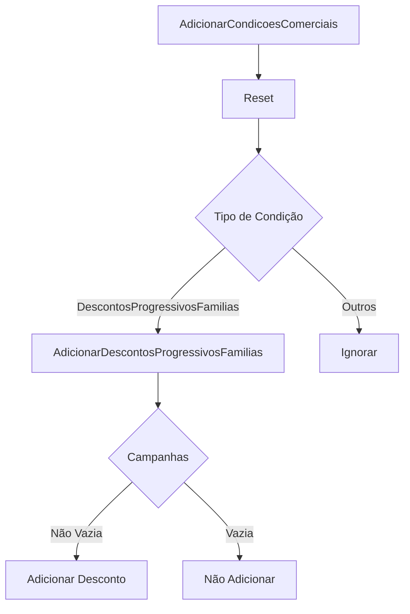
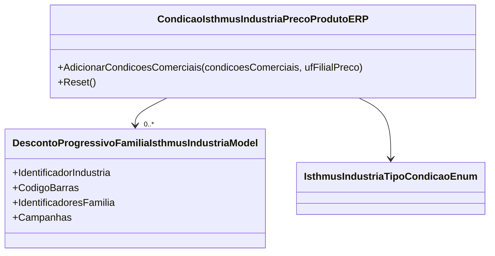

# CondicaoIsthmusIndustriaPrecoProdutoERP
**Namespace**: IsthmusWinthor.Dominio.POCO.Precos.IsthmusIndustrias  
**Nome do Arquivo**: CondicaoIsthmusIndustriaPrecoProdutoERP.cs

## Visão Geral e Responsabilidade
A classe `CondicaoIsthmusIndustriaPrecoProdutoERP` atua como um mecanismo de gerenciamento de condições comerciais específicas para produtos da indústria Isthmus. Ela lida com o armazenamento e a aplicação de descontos progressivos por família, de acordo com condições comerciais definidas. A principal função desta classe é garantir que os descontos sejam aplicados corretamente com base na unidade federativa da filial, contribuindo para a precisão na formação de preços e oferta de produtos.

## Métodos de Negócio

### AdicionarCondicoesComerciais (public)
- **Objetivo**: Este método valida e adiciona condições comerciais, aplicando a lógica específica de cada tipo de condição.
- **Comportamento**:
  1. Chama o método `Reset()` para limpar as condições existentes.
  2. Itera sobre a coleção de condições comerciais fornecidas.
  3. Para cada condição, verifica seu tipo.
  4. Se a condição for do tipo `DescontosProgressivosFamilias`, chama o método `AdicionarDescontosProgressivosFamilias`, passando a condição e a unidade federativa.
  
- **Retorno**: Não retorna valor; opera sobre o estado interno da classe.

### Reset (public)
- **Objetivo**: Inicializa ou limpa a lista de descontos progressivos.
- **Comportamento**:
  1. Atribui uma nova lista vazia à propriedade `_descontoProgressivoFamilia`.

- **Retorno**: Não retorna valor; serve para reinicializar o estado da classe.

### AdicionarDescontosProgressivosFamilias (private)
- **Objetivo**: Adiciona uma condição de desconto progressivo se ela atender às regras de aplicação com base na unidade federativa.
- **Comportamento**:
  1. Cria uma nova instância de `DescontoProgressivoFamiliaIsthmusIndustriaModel` utilizando dados da condição recebida.
  2. Filtra as campanhas associadas à condição com base na unidade federativa da filial.
  3. Se a lista filtrada de campanhas não estiver vazia, adiciona a nova condição à lista interna `_descontoProgressivoFamilia`.
  
- **Retorno**: Não retorna valor; modifica o estado interno da lista de descontos.

## Propriedades Calculadas e de Validação
- Nenhuma propriedade com lógica de cálculo ou validação foi identificada neste modelo.

## Navigations Property
- `[DescontoProgressivoFamiliaIsthmusIndustriaModel](DescontoProgressivoFamiliaIsthmusIndustriaModel.md)`

## Tipos Auxiliares e Dependências
- `[IsthmusIndustriaTipoCondicaoEnum](IsthmusIndustriaTipoCondicaoEnum.md)`
- `[ICondicaoIsthmusIndustria](ICondicaoIsthmusIndustria.md)`
- `[DescontoProgressivoFamiliaIsthmusIndustriaModel](DescontoProgressivoFamiliaIsthmusIndustriaModel.md)`

## Diagrama de Relacionamentos

