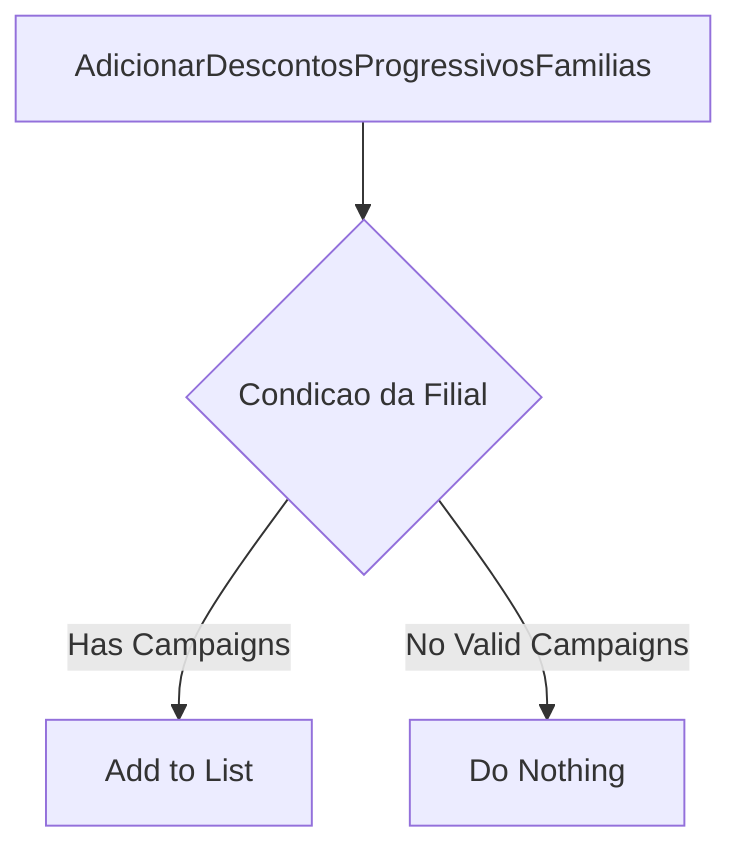
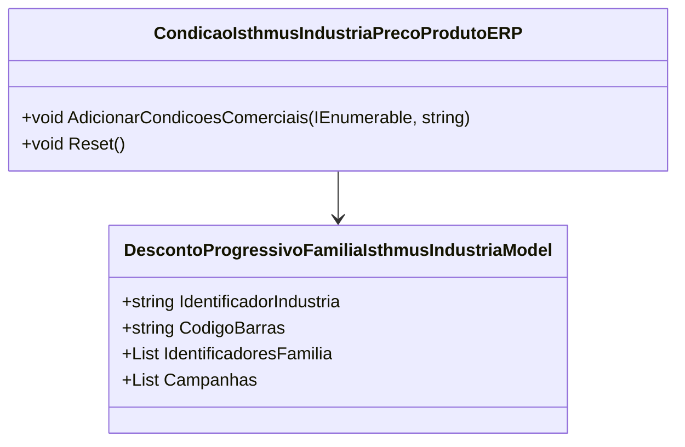

# CondicaoIsthmusIndustriaPrecoProdutoERP
**Namespace**: IsthmusWinthor.Dominio.POCO.Precos.IsthmusIndustrias  
**Nome do Arquivo**: CondicaoIsthmusIndustriaPrecoProdutoERP.cs  

## Visão Geral e Responsabilidade
A classe `CondicaoIsthmusIndustriaPrecoProdutoERP` é responsável por gerenciar as condições comerciais relacionadas ao preço dos produtos da indústria Isthmus. Ela permite a adicionamento e a manipulação de condições de descontos progressivos baseadas em famílias de produtos, oferecendo suporte à lógica de precificação dinâmica e adaptada a diferentes estados fiscais.

## Métodos de Negócio

### AdicionarCondicoesComerciais (public)
- **Objetivo**: Este método garante que as condições comerciais corretas sejam adicionadas à lista de descontos progressivos, considerando o estado da filial do produto.
- **Comportamento**: 
  1. Chama o método `Reset` para limpar o estado atual da lista de descontos.
  2. Itera sobre cada condição comercial fornecida.
  3. Avalia o tipo de cada condição:
     - Se a condição for do tipo `DescontosProgressivosFamilias`, chama o método `AdicionarDescontosProgressivosFamilias`, passando a condição e o estado.
  4. Ignora outras condições que não se enquadram no tipo especificado.
- **Retorno**: Não há retorno; o método modifica a lista interna de descontos progressivos.

### AdicionarDescontosProgressivosFamilias (private)
- **Objetivo**: Este método adiciona uma nova condição de desconto progressivo à lista se a condição estiver associada a campanhas válidas para a filial do preço.
- **Comportamento**:
  1. Cria uma nova instância de `DescontoProgressivoFamiliaIsthmusIndustriaModel` com os dados da condição fornecida.
  2. Filtra as campanhas da condição para incluir apenas aquelas relevantes para o estado da filial.
  3. Se houver campanhas válidas, adiciona a condição à lista de descontos progressivos.
- **Retorno**: Não há retorno; efetua alterações na lista interna se as condições forem válidas.

### Reset (public)
- **Objetivo**: Limpa todas as condições de descontos progressivos da classe para um estado inicial vazio.
- **Comportamento**: Reinicializa a lista interna de `_descontoProgressivoFamilia` como uma nova lista vazia.
- **Retorno**: Não há retorno.

## Propriedades Calculadas e de Validação
- **DescontoProgressivoFamilia**: Esta propriedade retorna uma lista de descontos progressivos que foram filtrados de acordo com as regras de negócio estabelecidas. A lógica de filtragem baseia-se na contrapartida da filial do estado, garantindo que apenas as condições relevantes sejam apresentadas.

## Navigations Property
- [DescontoProgressivoFamiliaIsthmusIndustriaModel](DescontoProgressivoFamiliaIsthmusIndustriaModel.md)

## Tipos Auxiliares e Dependências
- [ICondicaoIsthmusIndustria](ICondicaoIsthmusIndustria.md)
- [IsthmusIndustriaTipoCondicaoEnum](IsthmusIndustriaTipoCondicaoEnum.md)
- [DescontoProgressivoFamiliaIsthmusIndustriaModel](DescontoProgressivoFamiliaIsthmusIndustriaModel.md)

## Diagrama de Relacionamentos

---
Gerada em 29/12/2025 21:56:55
