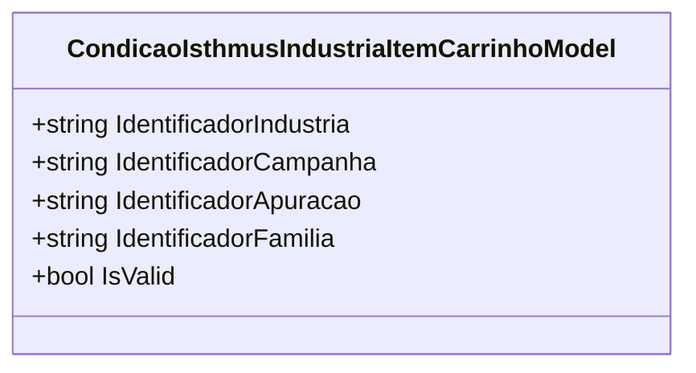

# CondicaoIsthmusIndustriaItemCarrinhoModel
**Namespace**: IsthmusWinthor.Dominio.POCO.Precos.IsthmusIndustrias.CondicoesComerciais  
**Nome do Arquivo**: CondicaoIsthmusIndustriaItemCarrinhoModel.cs  

## Visão Geral e Responsabilidade
A classe `CondicaoIsthmusIndustriaItemCarrinhoModel` representa as condições comerciais aplicáveis a um item de carrinho para a indústria Isthmus. Sua principal responsabilidade é garantir a integridade e validade dos identificadores que caracterizam as condições comerciais a serem aplicadas a um item específico em uma transação de venda, assegurando que todos os dados relevantes estão presentes e válidos.

## Métodos de Negócio
### Título: IsValid (Propriedade)
- **Objetivo**: Garante que todos os identificadores essenciais estão devidamente preenchidos e não são nulos ou espaços em branco.
- **Comportamento**: A propriedade `IsValid` avalia se todos os quatro identificadores: `IdentificadorIndustria`, `IdentificadorCampanha`, `IdentificadorApuracao`, e `IdentificadorFamilia` possuem valores válidos (ou seja, não são nulos ou apenas espaços em branco). Se todos os identificadores são válidos, `IsValid` retorna `true`; caso contrário, retorna `false`.
- **Retorno**: Um valor booleano que indica se a instância da classe possui todos os identificadores válidos.

## Propriedades Calculadas e de Validação
- **IsValid**: Esta propriedade calcula a validade do objeto com base nos quatro identificadores. Se qualquer um dos identificadores estiver vazio, a propriedade retorna `false`, garantindo que apenas instâncias válidas sejam consideradas no processo de negócios.

## Navigations Property
- Esta classe não possui propriedades de navegação, pois contém apenas identificadores de tipos primitivos.

## Tipos Auxiliares e Dependências
- Esta classe não utiliza enumeradores ou classes auxiliares externas.

## Diagrama de Relacionamentos

A documentação apresenta uma visão concisa do papel do `CondicaoIsthmusIndustriaItemCarrinhoModel` no domínio, com ênfase nas regras de negócio e validações que asseguram a consistência dos dados tratados pela classe.
---
Gerada em 29/12/2025 21:57:40
