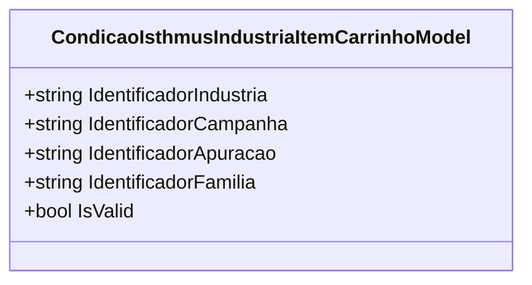

# CondicaoIsthmusIndustriaItemCarrinhoModel
**Namespace**: IsthmusWinthor.Dominio.POCO.Precos.IsthmusIndustrias.CondicoesComerciais  
**Nome do Arquivo**: CondicaoIsthmusIndustriaItemCarrinhoModel.cs  

## Visão Geral e Responsabilidade
A classe `CondicaoIsthmusIndustriaItemCarrinhoModel` representa uma condição relacionada a itens em um carrinho de compras dentro do contexto da indústria. O papel desta classe é garantir que todos os identificadores necessários (industria, campanha, apuração e família) estejam presentes e sejam válidos para que a condição comercial possa ser aplicada corretamente. Isso é essencial para a integridade dos dados comerciais que estão sendo processados, garantindo que não haja operações com dados incompletos ou inválidos.

## Métodos de Negócio

### Título: IsValid (Propriedade)
- **Objetivo**: Garante que todos os identificadores exigidos estejam devidamente atribuídos e não sejam nulos ou vazios.
- **Comportamento**: 
  1. Verifica se `IdentificadorIndustria` não é nulo ou vazio.
  2. Verifica se `IdentificadorCampanha` não é nulo ou vazio.
  3. Verifica se `IdentificadorApuracao` não é nulo ou vazio.
  4. Verifica se `IdentificadorFamilia` não é nulo ou vazio.
  5. Retorna `true` se todas as propriedades não forem nulas ou vazias; caso contrário, retorna `false`.
- **Retorno**: Um valor booleano que indica a validade da condição.

## Propriedades Calculadas e de Validação
### Propriedade: IsValid
- **Regra**: A propriedade `IsValid` é calculada com base na presença de todos os identificadores necessários. Isso assegura que uma instância da classe esteja em um estado válido, evitando a entrada e o processamento de dados incompletos que poderiam levar a erros durante operações comerciais.

## Navigations Property
Não há propriedades complexas do domínio ou navegações associadas a esta classe.

## Tipos Auxiliares e Dependências
Não há enumeradores ou classes estáticas/helpers que a classe utilize.

## Diagrama de Relacionamentos

Esta representação ilustra a classe principal `CondicaoIsthmusIndustriaItemCarrinhoModel` com suas propriedades, sem quaisquer indicações de relacionamentos complexos, sendo uma estrutura mais isolada sem dependências externas a serem representadas.
