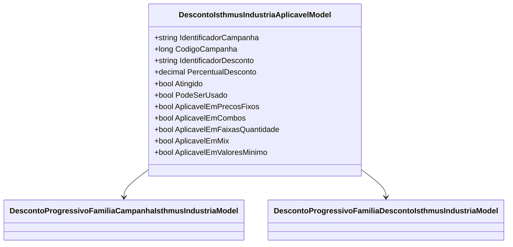

# DescontoIsthmusIndustriaAplicavelModel
**Namespace**: IsthmusWinthor.Dominio.POCO.Precos.IsthmusIndustrias.CondicoesComerciais.DescontosProgressivosFamilias  
**Nome do Arquivo**: DescontoIsthmusIndustriaAplicavelModel.cs  

## Visão Geral e Responsabilidade
A classe `DescontoIsthmusIndustriaAplicavelModel` representa um modelo de desconto aplicável na indústria Isthmus, contendo informações sobre campanhas e condições de desconto. Sua principal responsabilidade é calcular se um desconto específico pode ser aplicado com base nas condições definidas, como a validade do desconto, o número de famílias compradas e o ticket de compra, assegurando que sejam atendidas as regras de negócio da aplicação.

## Métodos de Negócio

### Título: `DescontoIsthmusIndustriaAplicavelModel` (Construtor)
- **Objetivo**: Este construtor garante a inicialização do objeto com informações necessárias para avaliar o desconto, assegurando que todas as regras de validação sejam aplicadas.
- **Comportamento**: Ao instanciar a classe, ele valida se as condições estão adequadas:
  - Verifica se o `IdentificadorCampanha`, `IdentificadorDesconto` não estão vazios e se `PercentualDesconto` é maior que zero.
  - Avalia se o ticket de compra atende ao valor mínimo e não ultrapassa o desconto máximo permitido.
  - Determina se o desconto é aplicável baseado nas condições passadas (forma de aplicação em preço fixo, combos, faixas de quantidade, etc.).
  - Define se o desconto pode ser usado com base no ticket ou nas condições previamente definidas.
- **Retorno**: Nenhum valor é retornado. O estado do objeto é definido conforme as condições.

### Título: `DesabilitarParaPrecosFixos` (Público)
- **Objetivo**: Desabilitar a aplicabilidade do desconto para preços fixos.
- **Comportamento**: O método altera a propriedade `AplicavelEmPrecosFixos` para `false`, indicando que o desconto não é mais válido para essa forma de aplicação.
- **Retorno**: Nenhum valor é retornado.

### Título: `DesabilitarParaCombos` (Público)
- **Objetivo**: Desabilitar a aplicabilidade do desconto para combos.
- **Comportamento**: Altera a propriedade `AplicavelEmCombos` para `false`, significando que o desconto não poderá ser utilizado em combos.
- **Retorno**: Nenhum valor é retornado.

### Título: `DesabilitarParaFaixasQuantidade` (Público)
- **Objetivo**: Desabilitar a aplicabilidade do desconto para faixas de quantidade.
- **Comportamento**: Define a propriedade `AplicavelEmFaixasQuantidade` como `false`, desautorizando o uso do desconto em compras dentro dessas regras.
- **Retorno**: Nenhum valor é retornado.

### Título: `DesabilitarParaMix` (Público)
- **Objetivo**: Desabilitar a aplicabilidade do desconto para misturas de produtos.
- **Comportamento**: Ajusta a propriedade `AplicavelEmMix` para `false`, excluindo a possibilidade de usar o desconto nesses casos.
- **Retorno**: Nenhum valor é retornado.

### Título: `DesabilitarParaValoresMinimo` (Público)
- **Objetivo**: Desabilitar a aplicabilidade do desconto em casos de valores mínimos.
- **Comportamento**: Configura a propriedade `AplicavelEmValoresMinimo` para `false`, indicando que o desconto não pode ser utilizado quando a condição de valor mínimo não é atendida.
- **Retorno**: Nenhum valor é retornado.

## Propriedades Calculadas e de Validação
- **Atingido**: Esta propriedade é válida quando:
  - A campanha e o desconto estão validados.
  - O ticket de compra atingir o valor mínimo.
  - O total de descontos não ultrapassar o máximo permitido.
  - O desconto for atingido com base no número de famílias compradas.
  
- **PodeSerUsado**: Dependendo da validação do ticket, ela pode retornar `true` ou `false`, dependendo se as precondições para o uso do desconto foram atendidas.

## Navigations Property
- [DescontoProgressivoFamiliaCampanhaIsthmusIndustriaModel](DescontoProgressivoFamiliaCampanhaIsthmusIndustriaModel.md)
- [DescontoProgressivoFamiliaDescontoIsthmusIndustriaModel](DescontoProgressivoFamiliaDescontoIsthmusIndustriaModel.md)

## Tipos Auxiliares e Dependências
- [DescontoProgressivoFamiliaCampanhaIsthmusIndustriaModel](DescontoProgressivoFamiliaCampanhaIsthmusIndustriaModel.md)
- [DescontoProgressivoFamiliaDescontoIsthmusIndustriaModel](DescontoProgressivoFamiliaDescontoIsthmusIndustriaModel.md)

## Diagrama de Relacionamentos

