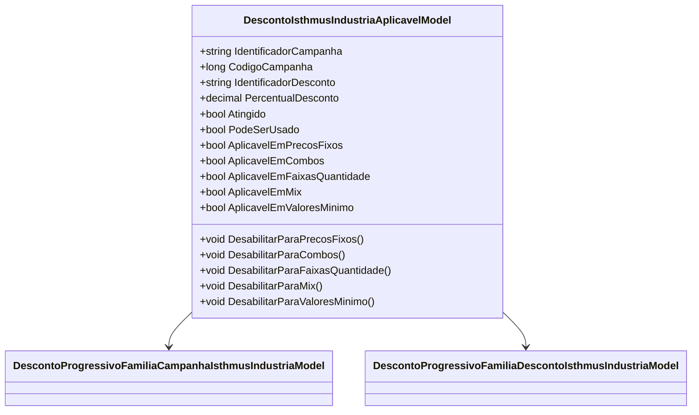

# DescontoIsthmusIndustriaAplicavelModel
**Namespace**: IsthmusWinthor.Dominio.POCO.Precos.IsthmusIndustrias.CondicoesComerciais.DescontosProgressivosFamilias  
**Nome do Arquivo**: DescontoIsthmusIndustriaAplicavelModel.cs  

## Visão Geral e Responsabilidade
A classe `DescontoIsthmusIndustriaAplicavelModel` representa um modelo de aplicação de desconto para a indústria Isthmus. Ela é responsável por determinar se um desconto específico é aplicável a uma campanha de vendas com base nas condições de compra, incluindo a verificação de valores mínimos e máximos de desconto e o número de famílias compradas. Esse modelo garante que os descontos sejam aplicados corretamente conforme as regras de negócios definidas.

## Métodos de Negócio

### Método: `DesabilitarParaPrecosFixos()`
- **Objetivo**: Desabilitar a aplicabilidade do desconto para preços fixos.
- **Comportamento**: Define a propriedade `AplicavelEmPrecosFixos` como `false`, indicando que o desconto não pode ser aplicado a produtos com preços fixos.
- **Retorno**: Não há retorno. O método modifica o estado do objeto.

### Método: `DesabilitarParaCombos()`
- **Objetivo**: Desabilitar a aplicabilidade do desconto para combos de produtos.
- **Comportamento**: Define a propriedade `AplicavelEmCombos` como `false`, indicando que o desconto não pode ser utilizado em combos.
- **Retorno**: Não há retorno. O método modifica o estado do objeto.

### Método: `DesabilitarParaFaixasQuantidade()`
- **Objetivo**: Desabilitar a aplicabilidade do desconto para faixas de quantidade.
- **Comportamento**: Define a propriedade `AplicavelEmFaixasQuantidade` como `false`, indicando que o desconto não pode ser utilizado ao atingir determinadas faixas de quantidade.
- **Retorno**: Não há retorno. O método modifica o estado do objeto.

### Método: `DesabilitarParaMix()`
- **Objetivo**: Desabilitar a aplicabilidade do desconto para misturas de produtos.
- **Comportamento**: Define a propriedade `AplicavelEmMix` como `false`, indicando que o desconto não pode ser aplicado em mix de produtos.
- **Retorno**: Não há retorno. O método modifica o estado do objeto.

### Método: `DesabilitarParaValoresMinimo()`
- **Objetivo**: Desabilitar a aplicabilidade do desconto quando um valor mínimo não é atendido.
- **Comportamento**: Define a propriedade `AplicavelEmValoresMinimo` como `false`, indicando que o desconto não pode ser utilizado se o valor mínimo não for atingido.
- **Retorno**: Não há retorno. O método modifica o estado do objeto.

## Propriedades Calculadas e de Validação
- **Atingido**: Esta propriedade representa se o desconto pode ser aplicado. A regra por trás da validação inclui verificações para garantir que a campanha esteja ativa, que os valores mínimo e máximo sejam atendidos, e que o desconto específico permita sua utilização com o número de famílias compradas.
  
- **PodeSerUsado**: Indica se o desconto pode ser utilizado baseando-se no total do ticket. Se o ticket for maior que zero, o desconto é considerado utilizável se `Atingido` for verdadeiro; caso contrário, considera-se válido apenas a estrutura do objeto.

## Navigations Property
- [DescontoProgressivoFamiliaCampanhaIsthmusIndustriaModel](DescontoProgressivoFamiliaCampanhaIsthmusIndustriaModel.md) 
- [DescontoProgressivoFamiliaDescontoIsthmusIndustriaModel](DescontoProgressivoFamiliaDescontoIsthmusIndustriaModel.md)

## Tipos Auxiliares e Dependências
- [TipoEnum](TipoEnum.md) *(presumido como enum necessário para validações, se houver)*

## Diagrama de Relacionamentos

---
Gerada em 29/12/2025 21:58:35
