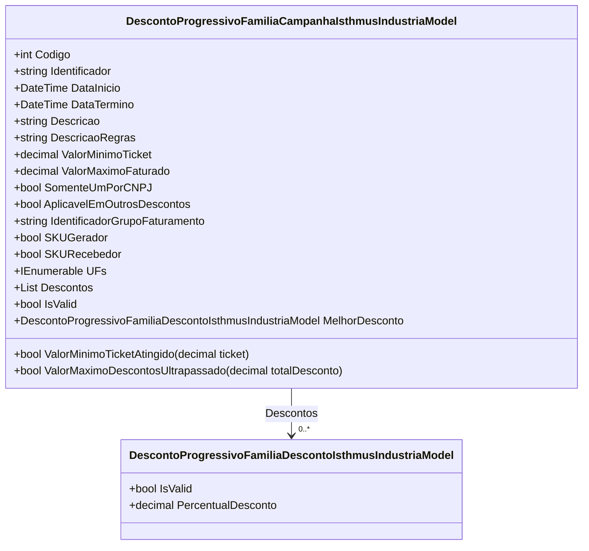

# DescontoProgressivoFamiliaCampanhaIsthmusIndustriaModel
**Namespace**: IsthmusWinthor.Dominio.POCO.Precos.IsthmusIndustrias.CondicoesComerciais.DescontosProgressivosFamilias  
**Nome do Arquivo**: DescontoProgressivoFamiliaCampanhaIsthmusIndustriaModel.cs  

## Visão Geral e Responsabilidade
A classe `DescontoProgressivoFamiliaCampanhaIsthmusIndustriaModel` representa um modelo de desconto progressivo aplicado a uma campanha específica da indústria Isthmus. Ela encapsula a lógica relacionada a regras de validade, datas de início e término, e atribuições de descontos que podem ser aplicados a pedidos de compra. O problema de negócio que ela resolve é garantir que os descontos sejam aplicados corretamente, respeitando as condições definidas, como valores mínimo e máximo, e condições especiais, como a aplicação em diferentes CNPJs.

## Métodos de Negócio

### Método: ValorMinimoTicketAtingido
**Visibilidade:** public  
**Objetivo:** Garante que o valor mínimo do ticket de compra seja atendido para que o desconto seja aplicável.  
**Comportamento:** 
1. Verifica se o `ValorMinimoTicket` é zero. Se sim, retorna `true`, indicando que não há restrição mínima.
2. Caso contrário, compara o `ticket` passado como argumento com o `ValorMinimoTicket` e retorna `true` se o `ticket` for maior ou igual, e `false` se não for.
**Retorno:** Retorna um valor booleano indicando se o valor mínimo foi atingido. 

### Método: ValorMaximoDescontosUltrapassado
**Visibilidade:** internal  
**Objetivo:** Verifica se o total de descontos aplicados excede o limite máximo permitido.  
**Comportamento:** 
1. Verifica se o `ValorMaximoFaturado` é maior que zero.
2. Compara o `totalDesconto` recebido com `ValorMaximoFaturado` e retorna `true` se o total de descontos ultrapassar este valor, e `false` caso contrário.
**Retorno:** Retorna um valor booleano que indica se o máximo de descontos foi ultrapassado.

### Propriedades Calculadas e de Validação
- **Propriedade:** `IsValid`  
  **Regra:** Um objeto `DescontoProgressivoFamiliaCampanhaIsthmusIndustriaModel` é considerado válido se pelo menos um dos SKUs (gerador ou recebedor) estiver marcado como `true`, se houver descontos válidos e se todos os descontos forem válidos.

- **Propriedade:** `MelhorDesconto`  
  **Regra:** Retorna o desconto válido com o maior percentual. Caso `SKURecebedor` não esteja marcado como `true`, retorna `null`.

### Navigations Property
- **Descontos**: Lista [DescontoProgressivoFamiliaDescontoIsthmusIndustriaModel](DescontoProgressivoFamiliaDescontoIsthmusIndustriaModel.md).

### Tipos Auxiliares e Dependências
- **Classes e Enums:**
  - [DescontoProgressivoFamiliaDescontoIsthmusIndustriaModel](DescontoProgressivoFamiliaDescontoIsthmusIndustriaModel.md)

### Diagrama de Relacionamentos

---
Gerada em 29/12/2025 21:58:57
