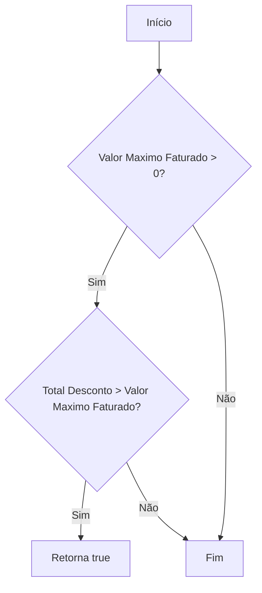
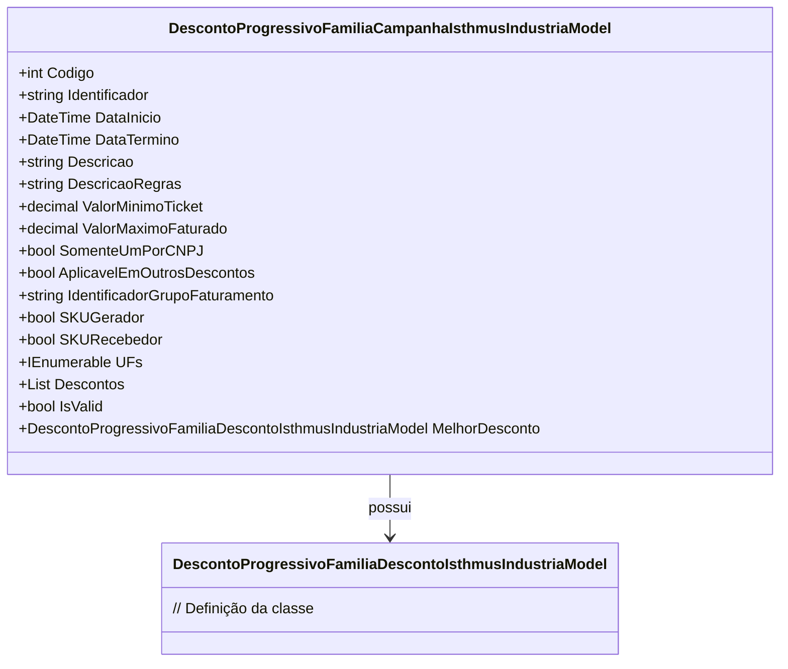

# DescontoProgressivoFamiliaCampanhaIsthmusIndustriaModel
**Namespace**: IsthmusWinthor.Dominio.POCO.Precos.IsthmusIndustrias.CondicoesComerciais.DescontosProgressivosFamilias  
**Nome do Arquivo**: DescontoProgressivoFamiliaCampanhaIsthmusIndustriaModel.cs  

## Visão Geral e Responsabilidade
A classe `DescontoProgressivoFamiliaCampanhaIsthmusIndustriaModel` é responsável pelo gerenciamento das condições de desconto progressivo aplicadas a campanhas de venda na indústria. Ela encapsula regras de negócio que determinam quando e como os descontos são aplicáveis, garantindo a integridade e a validação dos dados relacionados a esses descontos.

## Métodos de Negócio

### Título: ValorMinimoTicketAtingido (public)
- **Objetivo:** Garante que o valor mínimo do ticket seja atingido para que o desconto possa ser aplicado.
- **Comportamento:** O método verifica se o valor mínimo do ticket é igual a zero ou se o valor do ticket fornecido é maior ou igual ao valor mínimo.
- **Retorno:** Retorna `true` se o valor mínimo do ticket for atingido ou se não houver valor mínimo definido. Caso contrário, retorna `false`.

### Título: ValorMaximoDescontosUltrapassado (internal)
- **Objetivo:** Verifica se o total de descontos ultrapassa o valor máximo faturado definido.
- **Comportamento:** Compara o total de descontos informado com o valor máximo faturado. Se o valor máximo for maior que zero e o total de descontos exceder esse valor, o método indica que o limite foi ultrapassado.
- **Retorno:** Retorna `true` se o total de descontos ultrapassa o valor máximo permitido; caso contrário, retorna `false`.

## Propriedades Calculadas e de Validação

### Propriedade: IsValid
- **Regra:** A propriedade `IsValid` verifica se pelo menos uma das propriedades `SKUGerador` ou `SKURecebedor` é verdadeira, e se há descontos válidos associados à classe. Ela assegura que a lógica de aplicação de descontos só será válida se estiver de acordo com as regras definidas.

### Propriedade: MelhorDesconto
- **Regra:** A propriedade `MelhorDesconto` retorna o desconto mais alto aplicável, desde que `SKURecebedor` seja verdadeiro e existam descontos válidos.

## Navigations Property
- `[DescontoProgressivoFamiliaDescontoIsthmusIndustriaModel](DescontoProgressivoFamiliaDescontoIsthmusIndustriaModel.md)`

## Tipos Auxiliares e Dependências
- Nenhum tipo auxiliar ou enumeração adicional foi identificado como utilizado nesta classe.

## Diagrama de Relacionamentos

