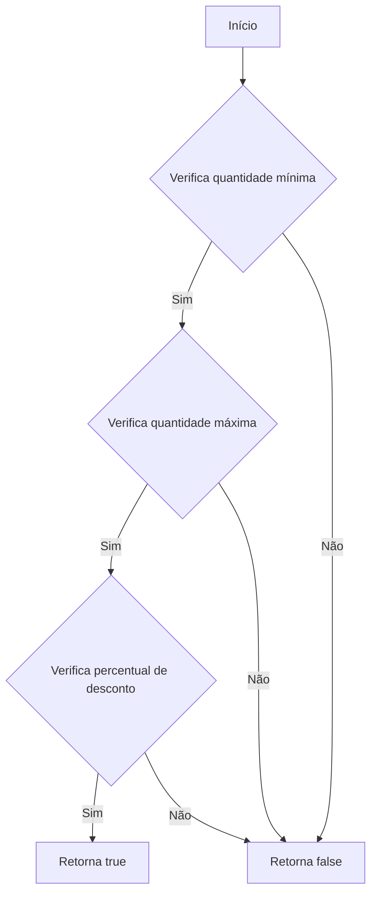
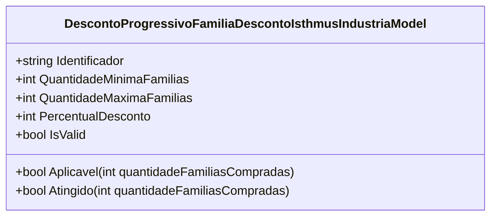

# DescontoProgressivoFamiliaDescontoIsthmusIndustriaModel
**Namespace**: IsthmusWinthor.Dominio.POCO.Precos.IsthmusIndustrias.CondicoesComerciais.DescontosProgressivosFamilias  
**Nome do Arquivo**: DescontoProgressivoFamiliaDescontoIsthmusIndustriaModel.cs

## Visão Geral e Responsabilidade
A classe `DescontoProgressivoFamiliaDescontoIsthmusIndustriaModel` representa um modelo que define as condições de um desconto progressivo aplicável a um grupo de famílias de produtos. O principal objetivo deste modelo é garantir que o desconto seja aplicado de maneira correta, respeitando limites mínimos e máximos de famílias que devem ser compradas. Isso ajuda a maximizar as vendas e a satisfação do cliente, criando incentivos adequados para aumentar as compras.

## Métodos de Negócio

### Título: Aplicavel (Public)
- **Objetivo**: Verificar se o desconto pode ser aplicado com base na quantidade de famílias compradas.
- **Comportamento**: 
    1. Valida se a quantidade de famílias compradas é maior ou igual à quantidade mínima estipulada.
    2. Valida se a quantidade de famílias compradas é menor ou igual à quantidade máxima estipulada.
    3. Considera o desconto como válido somente se o percentual de desconto for positivo.
- **Retorno**: Retorna `true` se o desconto é aplicável; caso contrário, retorna `false`.

### Título: Atingido (Public)
- **Objetivo**: Determinar se o desconto foi "atingido" com base na quantidade de famílias compradas.
- **Comportamento**: 
    1. Realiza a mesma verificação da quantidade mínima de famílias.
    2. Realiza a verificação da quantidade máxima de famílias.
    3. Valida se o percentual de desconto é maior que zero.
- **Retorno**: Retorna `true` se o desconto foi atingido, caso contrário, retorna `false`.

## Propriedades Calculadas e de Validação
- `IsValid`: Esta propriedade determina se o percentual de desconto é positivo. A regra é que para que um desconto seja considerado válido, seu percentual deve ser maior que zero.

## Navigations Property
Nenhuma propriedade de navegação complexa foi identificada nesta classe.

## Tipos Auxiliares e Dependências
Nenhum enumerador ou classe auxiliar está diretamente utilizado por esta classe.

## Diagrama de Relacionamentos

Essa documentação técnica oferece uma visão clara e estruturada sobre a classe `DescontoProgressivoFamiliaDescontoIsthmusIndustriaModel`, suas responsabilidades e regras de negócio, contribuindo para uma compreensão eficaz do seu funcionamento e integração em sistemas corporativos.
