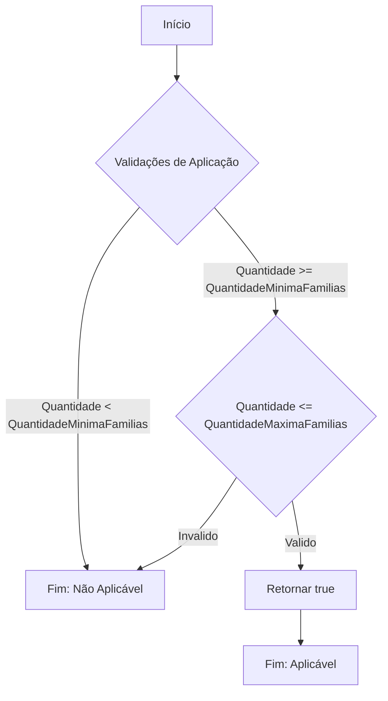
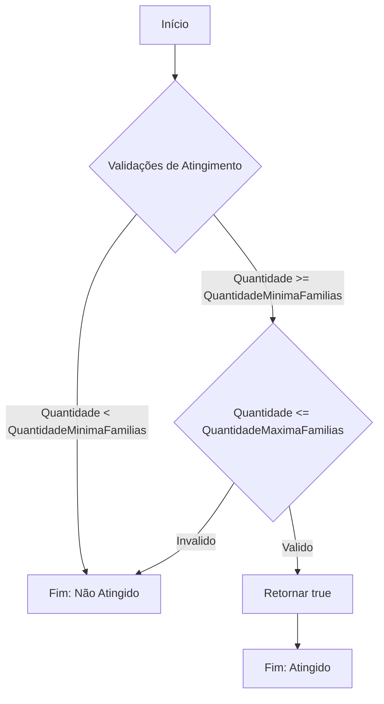
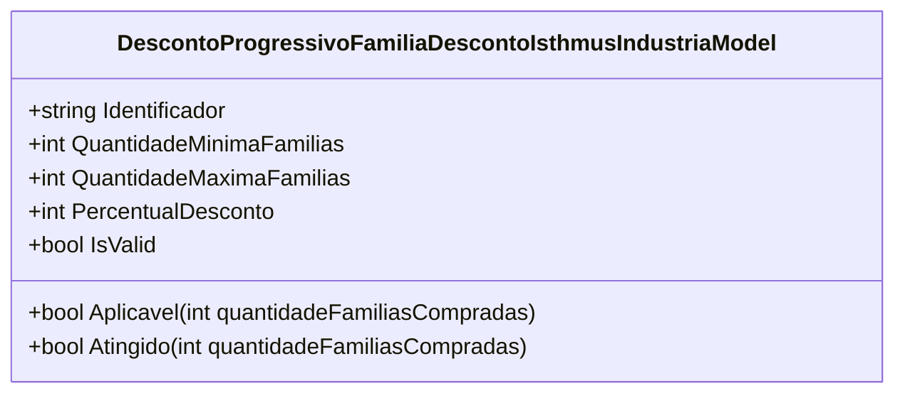

# DescontoProgressivoFamiliaDescontoIsthmusIndustriaModel
**Namespace**: IsthmusWinthor.Dominio.POCO.Precos.IsthmusIndustrias.CondicoesComerciais.DescontosProgressivosFamilias  
**Nome do Arquivo**: DescontoProgressivoFamiliaDescontoIsthmusIndustriaModel.cs    

## Visão Geral e Responsabilidade
A classe `DescontoProgressivoFamiliaDescontoIsthmusIndustriaModel` é responsável por gerenciar as condições de desconto progressivo aplicáveis em grupos de famílias de produtos. Sua função é garantir que os descontos sejam aplicados corretamente com base na quantidade de famílias compradas, estabelecendo faixas de descontos que incentivem compras em maior volume. Esta lógica é crucial para maximizar vendas e incentivar os clientes a adquirir mais produtos.

## Métodos de Negócio

### Método: Aplicavel
- **Visibilidade**: Public
- **Objetivo**: Este método verifica se as condições para a aplicação do desconto são atendidas com base na quantidade de famílias compradas.
- **Comportamento**:
  1. Verifica se a quantidade de famílias compradas (`quantidadeFamiliasCompradas`) é maior ou igual à `QuantidadeMinimaFamilias`.
  2. Verifica se a quantidade de famílias compradas é menor ou igual à `QuantidadeMaximaFamilias`.
  3. Assegura que o desconto é válido, ou seja, que o `PercentualDesconto` é maior que zero.
  4. Retorna `true` se todas as condições forem atendidas; caso contrário, retorna `false`.
- **Retorno**: Um valor booleano que indica se o desconto pode ser aplicado ou não.

### Método: Atingido
- **Visibilidade**: Public
- **Objetivo**: Este método determina se as condições do desconto foram atingidas com base na quantidade de famílias compradas.
- **Comportamento**: O comportamento e a lógica deste método são idênticos ao método `Aplicavel`, pois ambos verificam as mesmas condições.
- **Retorno**: Um valor booleano que indica se as condições de desconto foram atingidas ou não.

## Propriedades Calculadas e de Validação
- **IsValid**: Esta propriedade retorna `true` se o `PercentualDesconto` é maior que zero, validando assim a condição para que o desconto seja considerado aplicável. Isso previne a aplicação de descontos inválidos.

## Navigation Property
- Não há propriedades complexas do domínio nesta classe.

## Tipos Auxiliares e Dependências
- Nenhum enumerador ou classe auxiliar foi identificado como dependência direta nesta classe.

## Diagrama de Relacionamentos

---
Gerada em 29/12/2025 21:59:18
