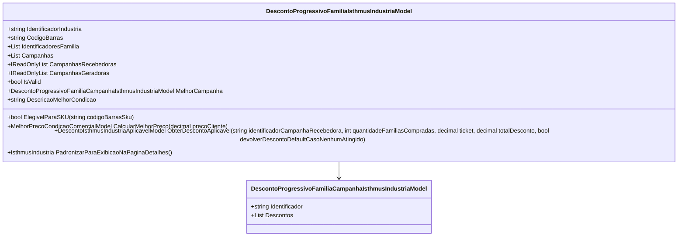

# DescontoProgressivoFamiliaIsthmusIndustriaModel
**Namespace**: IsthmusWinthor.Dominio.POCO.Precos.IsthmusIndustrias.CondicoesComerciais.DescontosProgressivosFamilias  
**Nome do Arquivo**: DescontoProgressivoFamiliaIsthmusIndustriaModel.cs  

## Visão Geral e Responsabilidade
A classe `DescontoProgressivoFamiliaIsthmusIndustriaModel` representa um modelo de desconto progressivo aplicável a famílias de produtos em uma indústria. Seu principal objetivo é calcular e gerenciar campanhas de desconto que variam de acordo com a quantidade de famílias adquiridas, facilitando a aplicação de regras comerciais e a obtenção do melhor preço para o cliente.

## Métodos de Negócio

### Título: ElegivelParaSKU (public)
**Objetivo**: Verifica se um determinado SKU é elegível para a aplicação de descontos com base no código de barras e se a condição de desconto é válida.  
**Comportamento**: 
1. Verifica se o código de barras fornecido não está vazio ou nulo.
2. Converte o código de barras tanto do SKU quanto do modelo para o formato numérico.
3. Compara os códigos de barras numéricos.
4. Retorna verdadeiro se o código de barras do SKU corresponder ao do modelo e a condição de desconto for válida; caso contrário, retorna falso.  
**Retorno**: `bool` - Indica se o SKU é elegível para desconto.

### Título: CalcularMelhorPreco (public)
**Objetivo**: Calcula o melhor preço disponível considerando o preço do cliente e a melhor campanha de desconto.  
**Comportamento**: 
1. Obtém o melhor desconto da melhor campanha disponível.
2. Se não houver campanha, define o desconto como zero.
3. Cria e retorna um objeto `MelhorPrecoCondicaoComercialModel` contendo as informações relacionadas ao melhor preço, incluindo o preço do cliente e melhor desconto.  
**Retorno**: `MelhorPrecoCondicaoComercialModel` - Contém informações sobre a melhor condição comercial e preço.

### Título: ObterDescontoAplicavel (public)
**Objetivo**: Obtém o desconto aplicável com base na campanha recebida e na quantidade de famílias compradas.  
**Comportamento**: 
1. Busca por uma campanha recebida que corresponda ao identificador fornecido e que tenha descontos aplicáveis para a quantidade de famílias compradas.
2. Se nenhuma campanha for encontrada e a opção para devolver o desconto padrão estiver ativa, a melhor campanha é procurada.
3. Busca o desconto aplicável na campanha. Se não encontrar, tenta usar o melhor desconto da campanha.
4. Se encontrar um desconto aplicável, cria um modelo de desconto aplicável, desabilita opções para combos e o retorna; caso contrário, retorna um modelo vazio.  
**Retorno**: `DescontoIsthmusIndustriaAplicavelModel` - Representa o desconto que pode ser aplicado na transação.

### Título: PadronizarParaExibicaoNaPaginaDetalhes (public)
**Objetivo**: Prepara os dados para apresentação na interface de detalhes do produto.  
**Comportamento**:
1. Cria e retorna um novo objeto `IsthmusIndustria` que inclui o identificador da família e uma lista de campanhas formatadas para exibição, ordenando os descontos por quantidade mínima e máxima de famílias.
  
**Retorno**: `IsthmusIndustria` - Um modelo formatado para exibição.

## Propriedades Calculadas e de Validação
### Propriedade: CampanhasRecebedoras
- Regra: Retorna uma lista apenas das campanhas que são válidas e têm o SKU configurado como recebedor.

### Propriedade: CampanhasGeradoras
- Regra: Retorna uma lista apenas das campanhas que são válidas e têm o SKU configurado como gerador.

### Propriedade: IsValid
- Regra: Indica se há pelo menos uma campanha válida dentro da lista de campanhas.

### Propriedade: MelhorCampanha
- Regra: Obtém a melhor campanha dentre as campanhas recebedoras, ordenando-as de acordo com o percentual de desconto do melhor desconto disponível.

### Propriedade: DescricaoMelhorCondicao
- Regra: Formata uma string com a descrição do melhor desconto, caso ele exista.

## Navigation Property
- [DescontoProgressivoFamiliaCampanhaIsthmusIndustriaModel](DescontoProgressivoFamiliaCampanhaIsthmusIndustriaModel.md)

## Tipos Auxiliares e Dependências
- [IsthmusIndustriaTipoCondicaoEnum](IsthmusIndustriaTipoCondicaoEnum.md)
- [MelhorPrecoCondicaoComercialModel](MelhorPrecoCondicaoComercialModel.md)
- [DescontoIsthmusIndustriaAplicavelModel](DescontoIsthmusIndustriaAplicavelModel.md)
- [UtilEnumDescription](UtilEnumDescription.md)

## Diagrama de Relacionamentos

---
Gerada em 29/12/2025 21:59:50
