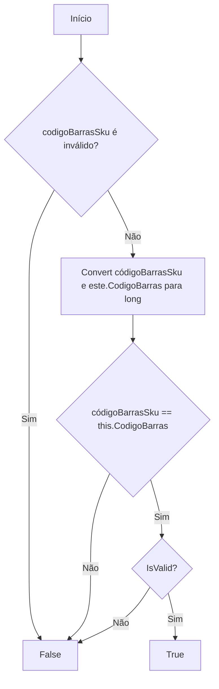
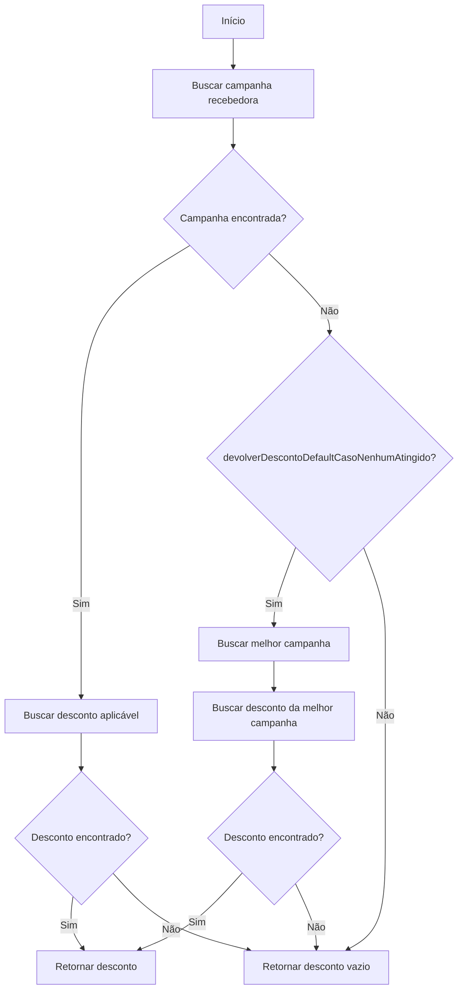
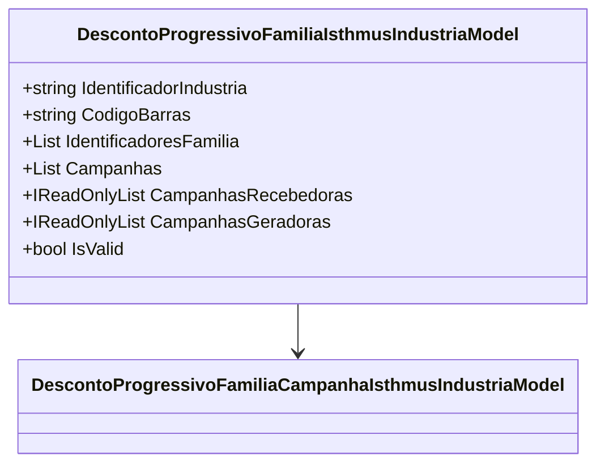

# DescontoProgressivoFamiliaIsthmusIndustriaModel
**Namespace**: IsthmusWinthor.Dominio.POCO.Precos.IsthmusIndustrias.CondicoesComerciais.DescontosProgressivosFamilias  
**Nome do Arquivo**: DescontoProgressivoFamiliaIsthmusIndustriaModel.cs  

## Visão Geral e Responsabilidade
A classe `DescontoProgressivoFamiliaIsthmusIndustriaModel` é responsável por modelar condições comerciais relacionadas a descontos progressivos aplicáveis a diferentes famílias de produtos. Ela busca resolver a necessidade de aplicar regras de desconto baseadas nas campanhas de vendas e no tratamento diferenciado por família, proporcionando uma forma organizada de validar e calcular os melhores preços com base em campanhas específicas.

## Métodos de Negócio

### ElegivelParaSKU (public)
- **Objetivo**: Garante que o SKU fornecido é elegível para os descontos, validando se o código de barras associado é o mesmo e se as campanhas são válidas.
- **Comportamento**:
  1. Verifica se o `codigoBarrasSku` é inválido (nulo ou em branco).
  2. Converte os códigos de barras para long.
  3. Compara o código de barras do SKU com o código de barras da instância.
  4. Retorna `true` se forem iguais e a condição for válida; caso contrário, retorna `false`.
- **Retorno**: Retorna um booleano que indica a elegibilidade do SKU para a aplicação dos descontos.

### CalcularMelhorPreco (public)
- **Objetivo**: Calcula o melhor preço aplicável ao cliente com base no desconto escolhido pela campanha.
- **Comportamento**:
  1. Obtém o percentual de desconto da melhor campanha.
  2. Cria uma nova instância de `MelhorPrecoCondicaoComercialModel` passando os parâmetros relevantes como código da campanha, data de término, quantidade mínima de famílias, preço cliente e valor mínimo de ticket.
- **Retorno**: Retorna um objeto do tipo `MelhorPrecoCondicaoComercialModel` que contém as melhores condições comerciais.

### ObterDescontoAplicavel (public)
- **Objetivo**: Retorna o desconto aplicável para uma campanha específica com base nas quantidades de famílias e condições de ticket.
- **Comportamento**:
  1. Busca a campanha recebedora válida que corresponde ao identificador fornecido e que aplicada ao número de famílias compradas.
  2. Se não encontrada e `devolverDescontoDefaultCasoNenhumAtingido` é verdadeiro, busca a melhor campanha.
  3. Busca o desconto aplicável na campanha encontrada.
  4. Se nenhum desconto aplicável e `devolverDescontoDefaultCasoNenhumAtingido` é verdadeiro, retorna o melhor desconto.
  5. Se um desconto aplicável é encontrado, cria um modelo `DescontoIsthmusIndustriaAplicavelModel`.
  6. Desabilita o desconto para combos e retorna o desconto aplicável.
- **Retorno**: Retorna um objeto do tipo `DescontoIsthmusIndustriaAplicavelModel` representando o desconto que pode ser aplicado.

### PadronizarParaExibicaoNaPaginaDetalhes (public)
- **Objetivo**: Prepara a representação de `IsthmusIndustria` para exibição em painéis detalhados, extraindo e formatando as campanhas e descontos.
- **Comportamento**:
  1. Cria uma nova instância de `IsthmusIndustria`.
  2. Popula as propriedades de família e campanhas.
  3. Para cada campanha, organiza os descontos por quantidade mínima e máxima de famílias.
- **Retorno**: Retorna uma instância de `IsthmusIndustria` pronta para exibição nos detalhes.

## Propriedades Calculadas e de Validação

### CampanhasRecebedoras
- **Regra**: Filtra e retorna somente as campanhas que são válidas e têm a flag `SKURecebedor` marcada.

### CampanhasGeradoras
- **Regra**: Filtra e retorna somente as campanhas que são válidas e têm a flag `SKUGerador` marcada.

### IsValid
- **Regra**: Retorna `true` se existe ao menos uma campanha válida.

### MelhorCampanha
- **Regra**: Retorna a campanha recebedora com o melhor percentual de desconto aplicável.

## Navigations Property
- [DescontoProgressivoFamiliaCampanhaIsthmusIndustriaModel](DescontoProgressivoFamiliaCampanhaIsthmusIndustriaModel.md)

## Tipos Auxiliares e Dependências
- [IsthmusIndustriaTipoCondicaoEnum](IsthmusIndustriaTipoCondicaoEnum.md)
- [MelhorPrecoCondicaoComercialModel](MelhorPrecoCondicaoComercialModel.md)
- [DescontoIsthmusIndustriaAplicavelModel](DescontoIsthmusIndustriaAplicavelModel.md)
- [UtilEnumDescription](UtilEnumDescription.md)

## Diagrama de Relacionamentos

