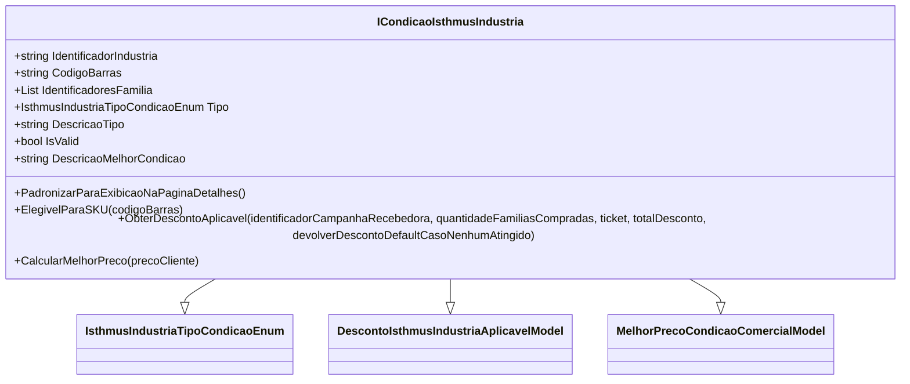

# ICondicaoIsthmusIndustria
**Namespace**: IsthmusWinthor.Dominio.POCO.Precos.IsthmusIndustrias.CondicoesComerciais  
**Nome do Arquivo**: ICondicaoIsthmusIndustria.cs  

## Visão Geral e Responsabilidade
A interface `ICondicaoIsthmusIndustria` define um contrato para condições comerciais aplicáveis aos produtos da indústria Isthmus. Seu papel principal é garantir a validação e o cálculo de descontos e preços aplicáveis, permitindo a estruturação de regras de negócios específicas para diferentes campanhas e condições de vendas. Ela assegura que as condições de preço e desconto sejam aplicadas adequadamente, facilitando a gestão comercial e a oferta competitiva.

## Métodos de Negócio

### Método: `ObterDescontoAplicavel`
- **Visibilidade**: público
- **Objetivo**: Garante que o desconto aplicável a determinada campanha seja corretamente calculado considerando a quantidade comprada e o total de desconto concedido.
- **Comportamento**: 
  1. Recebe os parâmetros: `identificadorCampanhaRecebedora`, `quantidadeFamiliasCompradas`, `ticket`, `totalDesconto`, e `devolverDescontoDefaultCasoNenhumAtingido`.
  2. Avalia se a campanha é válida e se a `quantidadeFamiliasCompradas` atende aos critérios de elegibilidade.
  3. Calcula o desconto possível com base nas regras internas definidas para a campanha.
  4. Retorna um objeto `DescontoIsthmusIndustriaAplicavelModel` que encapsula o desconto calculado e suas condições.
- **Retorno**: Um modelo que contém o desconto aplicável e suas características, permitindo a visualização e aplicação desse desconto em transações comerciais.

### Método: `CalcularMelhorPreco`
- **Visibilidade**: público
- **Objetivo**: Determina o melhor preço possível para um cliente com base em condições disponíveis.
- **Comportamento**:
  1. Recebe o preço do cliente como parâmetro.
  2. Avalia todas as condições disponíveis para encontrar a condição que oferece o melhor preço.
  3. Retorna um modelo `MelhorPrecoCondicaoComercialModel` com as informações sobre a condição que resultou no melhor preço.
- **Retorno**: Um objeto que representa a melhor condição comercial, permitindo ao cliente obter o preço mais vantajoso.

## Propriedades Calculadas e de Validação
- `IsValid`: Valida se a condição é aplicável com base em regras de negócio internas. Retorna verdadeiro se todas as regras de validação forem atendidas.
- `DescricaoMelhorCondicao`: Calcula e fornece uma descrição textual da melhor condição disponível, baseada na aplicação das regras de negócio.

## Navigation Property
- Não existem Navigation Properties definidas nesta interface.

## Tipos Auxiliares e Dependências
- Dependências Internas:
  - `[IsthmusIndustriaTipoCondicaoEnum](IsthmusIndustriaTipoCondicaoEnum.md)`
  - `[DescontoIsthmusIndustriaAplicavelModel](DescontoIsthmusIndustriaAplicavelModel.md)`
  - `[MelhorPrecoCondicaoComercialModel](MelhorPrecoCondicaoComercialModel.cs)`

## Diagrama de Relacionamentos

