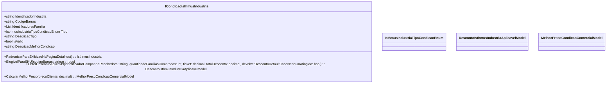

# ICondicaoIsthmusIndustria
**Namespace**: IsthmusWinthor.Dominio.POCO.Precos.IsthmusIndustrias.CondicoesComerciais  
**Nome do Arquivo**: ICondicaoIsthmusIndustria.cs  

## Visão Geral e Responsabilidade
A interface `ICondicaoIsthmusIndustria` define um contrato para as condições comerciais associadas à indústria no contexto do sistema. Seu principal objetivo é fornecer métodos para calcular descontos e determinar a melhor condição de preço para diferentes situações de venda, garantindo que as regras de negócio relacionadas ao pricing e descontos sejam sempre respeitadas.

## Métodos de Negócio

### ObterDescontoAplicavel
- **Título**: `ObterDescontoAplicavel` - Visibilidade Pública
- **Objetivo**: Este método garante que o sistema possa calcular o desconto aplicável a uma campanha comercial baseada em diversos critérios, como a quantidade de famílias compradas e o total de desconto já aplicado.
- **Comportamento**: 
  1. Recebe parâmetros como o identificador da campanha, a quantidade de famílias compradas, o ticket e o total de desconto.
  2. Avalia se os critérios para aplicar o desconto são atendidos.
  3. Retorna um modelo de desconto que representa o desconto calculado ou aplicável, considerando as regras de negócio integradas.
- **Retorno**: O retorno é um objeto do tipo `DescontoIsthmusIndustriaAplicavelModel`, que contém detalhes sobre o desconto que pode ser aplicado.

### CalcularMelhorPreco
- **Título**: `CalcularMelhorPreco` - Visibilidade Pública
- **Objetivo**: Este método calcula a melhor condição comercial de preço para um cliente específico, considerando o preço atual do cliente.
- **Comportamento**:
  1. Recebe como parâmetro o preço do cliente.
  2. Avalia as condições comerciais disponíveis e aplica as regras de precificação específicas.
  3. Retorna o modelo com a melhor condição de preço baseada nas lógicas de negócio envolvidas.
- **Retorno**: O retorno é um objeto do tipo `MelhorPrecoCondicaoComercialModel`, representando a condição de preço mais vantajosa para o cliente.

## Propriedades Calculadas e de Validação
Nenhuma propriedade na interface possui lógica no `get` ou validação no `set`, já que a interface define apenas contratos para acessar dados.

## Navigations Property
Nenhuma propriedade de navegação foi identificada nesta interface, pois ela contém somente tipos primitivos e listas.

## Tipos Auxiliares e Dependências
- `IsthmusIndustriaTipoCondicaoEnum`: Enum que representa os tipos de condições comerciais da indústria.
- `DescontoIsthmusIndustriaAplicavelModel`: Modelo que encapsula as informações de desconto aplicável.
- `MelhorPrecoCondicaoComercialModel`: Modelo que encapsula as informações sobre a melhor condição comercial de preço.

## Diagrama de Relacionamentos

---
Gerada em 29/12/2025 21:57:57
